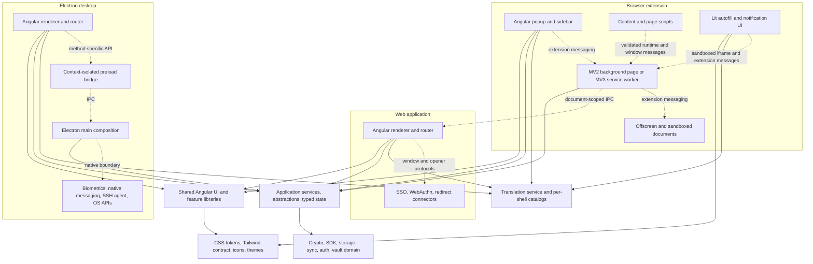

# Frontend redesign and framework-migration decision dossier

Status: decision support, not a visual design, product design, information-architecture, branding, or framework decision.

Branch: `docs/frontend-redesign-architecture`

Exact base: `1f881babc15eb7d3a88cad41730ce167d8e49a41` (`origin/main` and the locally available `upstream/main` both pointed to this commit when the inventory was taken). No fetch was performed and no runtime, schema, commercial source, build, package, or application file is changed by this dossier.

## Executive finding

The repository does not contain one replaceable frontend. It contains three Angular renderers, a framework-neutral service/state core, a browser extension split across popup, background, content, sandboxed overlay, notification, and offscreen contexts, and an Electron application split across renderer, preload, main, and native/OS integrations.

The measured open-source surface is 681 Angular components, 81 directives, 18 pipes, and 317 route-path declarations. It also contains 183 injectable classes, 1,160 `inject()` calls, 540 object-form provider bindings, 208 state-key declarations, and 766 service/state boundary files. Those figures make a one-step replacement a platform migration, not a component-library swap. See the reproducible [measured inventory](./measured-inventory.md).

The recommended process is therefore:

1. Preserve the Angular applications as the behavioral baseline.
2. Extract or formalize framework-neutral view-model and command/query ports at existing service boundaries.
3. Compare an Angular-modernized implementation, a React island, and a Lit/custom-element island on the same non-sensitive leaf surface outside production.
4. Use explicit gates to decide whether to stop, continue Angular, or migrate one shell at a time.

This is a recommendation for a reversible evaluation path. It deliberately does not select a final framework or approve a visual redesign.

## What is verified

The inventory script uses tracked files, Node.js, and Git only. Its lexical limitations are documented in the generated report.

| Verified fact | Evidence | Architectural consequence |
| --- | --- | --- |
| Web, browser popup, and desktop renderer bootstrap Angular `AppModule`s. | [web bootstrap](../../../apps/web/src/main.ts#L1-L12), [browser bootstrap](../../../apps/browser/src/popup/main.ts#L1-L28), [desktop bootstrap](../../../apps/desktop/src/app/main.ts#L1-L23) | A renderer replacement must account for three bootstrap, router, provider, and packaging compositions. |
| The root uses Angular 21.2, RxJS 7.8, Lit 3.3, webpack, Nx, Jest, and two Storybook renderers. | [root dependencies and tools](../../../package.json#L48-L224) | Angular is current repository infrastructure; Lit is a real but narrow production precedent; React is not an application dependency. |
| React 18 appears in root overrides, while the measured production application surfaces have no React imports. The one measured React file is Storybook tooling. | [root overrides](../../../package.json#L227-L242), [feature-flag Storybook panel](../../../libs/storybook/src/addons/feature-flags/panel.tsx) | React is a plausible new choice, not an already-adopted product framework. Its setup and migration cost must be counted. |
| `libs/components` exports the shared Angular design-system surface. | [component-library barrel](../../../libs/components/src/index.ts#L1-L61) | Existing components are reusable by all three Angular renderers, but not directly portable to another renderer. |
| `JslibModule` is explicitly deprecated in favor of standalone imports. | [deprecation and module contents](../../../libs/angular/src/jslib.module.ts#L44-L117) | Angular modernization has an existing, source-endorsed path and is a necessary baseline in any comparison. |
| Core packages inspected by the inventory (`common`, `state`, `state-internal`, `storage-core`, `messaging`, `logging`, `serialization`, and `user-core`) have zero Angular imports. | [inventory method and results](./measured-inventory.md#framework-and-boundary-inventory) | A migration can reuse substantial behavior without moving crypto, storage, synchronization, or account state into a new UI framework. |
| State is expressed through typed global, user, and derived providers and named key definitions. | [state-provider contract](../../../libs/state/src/core/state.provider.ts#L18-L80), [key definition](../../../libs/state/src/core/key-definition.ts#L57-L171), [platform-specific state locations](../../../libs/state/src/core/state-definitions.ts#L52-L165) | UI adapters must preserve user scoping, serialization, cleanup, and per-platform storage behavior. A generic client-side store is not a drop-in replacement. |
| Angular compositions use explicit, type-checked provider definitions; browser background and Electron main construct equivalent graphs manually. | [`safeProvider` contract](../../../libs/ui/common/src/di/safe-provider.ts#L31-L138), [web providers](../../../apps/web/src/app/core/core.module.ts#L192-L234), [browser background composition](../../../apps/browser/src/background/main.background.ts#L1020-L1118), [Electron main composition](../../../apps/desktop/src/main.ts#L143-L230) | The service graph already has seams outside Angular DI. Extracting a framework-neutral facade is lower risk than rewriting services or state. |
| Browser autofill has a separate Lit/Web Components Storybook. | [Lit package scripts](../../../apps/browser/src/autofill/content/components/package.json#L1-L8), [Web Components Storybook](../../../apps/browser/src/autofill/content/components/.lit-storybook/main.ts#L13-L47) | Lit is a credible candidate for framework-neutral leaf components, especially in injected/embedded contexts, but is not evidence of app-scale routing/forms maturity here. |
| Root Storybook is Angular and composes the autofill Storybook; it already provides themes, accessibility checks, and feature-flag controls. | [root Storybook](../../../.storybook/main.ts#L11-L113), [preview decorators](../../../.storybook/preview.tsx#L26-L77) | A fair pilot can run implementations against the same stories, themes, flags, fixtures, and accessibility expectations without shipping them. |
| The local `origin/main` and `upstream/main` refs were aligned; 250 locally available upstream commits touched hundreds of frontend files. | [bounded churn sample](./measured-inventory.md#upstream-sync-surface) | Large file moves or rewrites create recurring reconciliation cost even before feature work is considered. |

## Current dependency graph

Solid arrows are in-process dependencies. Dashed arrows cross a security or lifecycle boundary and must remain explicit regardless of UI framework.

This graph is the key design constraint: changing renderer technology does not remove the extension service-worker lifecycle, the page/content trust boundary, Electron isolation, native integrations, or the shared state and crypto contracts.

## Surface matrix

“Share” means share source or a stable contract, not force identical presentation across form factors.

| Surface | Current implementation | Share now | Keep shell-specific | Next reversible action | Gate before migration |
| --- | --- | --- | --- | --- | --- |
| Design tokens, icons, typography, spacing | CSS custom properties, prefixed Tailwind utilities, Angular components | Token names, icon assets, CSS primitives, theme class contract | Component implementation and overlay integration | Publish a framework-neutral token entry point and render the same token fixture in Angular, React, and Lit harnesses | No computed-style drift for approved fixtures in light and dark themes |
| Shared component library | 135 components and 47 directives in `libs/components` | Behavioral specifications, DOM semantics, test fixtures, design tokens | Angular component classes, CDK overlays, Angular forms integration | Classify components as primitive, composite, or shell-integrated; pilot primitives only | Keyboard, focus, screen-reader, overlay, and visual-regression parity |
| Legacy Angular aggregation | Deprecated `JslibModule` plus direct imports | Standalone components, pipes, directives, service contracts | NgModule aggregation | Continue standalone conversion only where touched; measure dependency reduction | No route/provider behavior change and no increase in duplicate bundles |
| Authentication, unlock, account switching | Shared common services plus shell-specific Angular screens | Use-case ports, state streams, validation, error mapping | WebAuthn connectors, extension popouts, native biometrics, OS credential storage | Define read-only view models and explicit commands without moving secrets into UI-owned state | Existing lock, logout, timeout, and account-switch tests remain authoritative |
| Vault list/detail/edit | Shared domain/services and substantial Angular UI in app and `libs/vault` | Query results, selection model, commands, permission decisions | Popup sizing/navigation, desktop actions, web organization routes | Extract one view-model facade behind existing Angular UI before any renderer pilot | Identical authorization, search, selection, and secret-redaction behavior |
| Generator, Send, import/export | Shared feature libraries with shell adapters | Pure generation logic, validation, serializable view models | File pickers/downloads, clipboard, native browser import, route containers | Choose a low-privilege leaf by the pilot criteria below | No clipboard/file/native capability added to the generic UI layer |
| Web route/layout shell | 160 measured route paths in 12 OSS files, plus commercial routes | Route names as test fixtures and navigation intent | Deployment URLs, connector documents, organization/billing composition, commercial overlays | Model navigation behind a small port before changing router ownership | Deep links, redirects, guards, lazy loading, and commercial overlay compatibility |
| Browser popup/sidebar shell | Angular app with 95 route paths and popup-specific layout/services | Shared view models and Angular components today | Popup size, sidebar location, browser permissions, background messaging | Keep Angular as control; pilot a leaf mounted below an existing route boundary | Chrome, Firefox, Safari, popup, sidebar, and pop-out behavior all pass |
| Browser content/autofill UI | Plain content scripts plus Lit templates/custom elements in isolated/sandboxed documents | Lit primitives, message schemas, theme and locale contracts | DOM discovery, page-script injection, iframe trust, focus routing, WebAuthn interception | Extend the existing Lit harness only for content-context candidates | CSP-compatible bundle, zero remote code, origin/sender checks, cross-frame focus parity |
| Browser background | Manual framework-neutral composition in MV2 page or MV3 worker | Core services, state providers, message schemas | Worker lifecycle, alarms, permissions, offscreen-document coordination | Do not migrate as UI work; expose narrower commands/queries if needed | No reliance on global in-memory lifetime; event registration and persistence remain valid |
| Web connectors | Separate HTML/webpack entries for SSO, WebAuthn, redirects, and proxy flows | Protocol types and validation | Window/opener messaging, URL/origin handling, deployment paths | Treat as security adapters, not general UI islands | Origin/state/nonce behavior and CSP unchanged |
| Desktop renderer | Angular application with 62 route paths | Shared UI while Angular remains; framework-neutral view models later | Window sizing, menu-triggered routes, native feature affordances | Pilot only after the same facade works in web or browser | Renderer remains isolated from Node and privileged APIs |
| Desktop preload/main | Context bridge with five namespaces, 53 main registrations and 75 renderer/preload calls or listeners | Typed request/response contracts | Electron lifecycle, OS APIs, native messaging, updater, biometrics, SSH agent | Replace broad or UI-shaped calls with narrow capability methods only when already in scope | `contextIsolation`, `nodeIntegration: false`, sender validation, and method allowlists preserved |
| Localization | Shared service and pipe; 66 web, 63 browser, and 66 desktop locale bundles | Translation API, key typings, placeholders, fallback rules | Bundle loading and platform locale registration | Generate key-contract fixtures for pilot stories; do not consolidate catalogs yet | Placeholder, pluralization, fallback, RTL, and locale-switch behavior match |
| Theming | Shared state service, CSS tokens, `theme_light` and `theme_dark`; web pre-bootstrap application | Theme enum/state, CSS token files, class contract | Web anti-flash bootstrap, Safari popup workaround, Electron system-theme bridge | Consume existing tokens from every pilot; do not fork colors or semantic names | No flash, system-theme update, or contrast regression |
| Storybook and tests | Angular Storybook plus composed Lit Storybook; Jest specs across apps/libs | Fixtures, interaction contracts, accessibility assertions, feature flags | Renderer-specific mounting and mocks | Add one framework-neutral fixture contract and renderer adapters | Same scenario set passes for every compared implementation |
| Commercial overlays | 139 measured components and 89 route paths, read-only in this lane | Only existing public contracts and OSS extension points | All commercial source and build composition | Inventory dependencies and compatibility points without editing them | No migration slice that requires commercial-source changes may proceed in this lane |

## What can and cannot be shared

### Safe sharing targets

- Domain models, cryptography, authorization, account, vault, sync, and storage services already living outside Angular.
- Typed state providers and state keys, including their platform-specific storage-location behavior.
- View-model facades that expose immutable display data and explicit commands while keeping service ownership outside the renderer framework.
- Validation functions and error-to-message-key mapping that do not import a renderer framework.
- Translation keys, placeholder contracts, locale fixtures, theme selection, CSS tokens, icons, and accessibility expectations.
- Story data, interaction scenarios, and security-boundary contract tests.
- Leaf custom elements whose public API is standard properties, attributes, and events and whose styling consumes the shared token contract.

### Boundaries that must remain platform-specific

- Browser manifest permissions, CSP, MV2 background-page behavior, MV3 worker lifetime, offscreen documents, sandboxed pages, and browser-specific manifest transforms.
- Content-script DOM discovery, page-world injection, cross-frame identity, origin validation, focus routing, and autofill authorization.
- Web connector URLs and opener/window messaging for SSO, WebAuthn, Duo, redirects, and proxy-cookie flows.
- Electron main and preload code, native messaging, biometrics, updater, menus, secure credential storage, filesystem/browser imports, SSH agent, and OS integration.
- Popup/sidebar sizing and navigation, desktop window behavior, and web deployment/deep-link semantics.
- Commercial route and provider overlays unless separately authorized.

Trying to unify these shell adapters would hide privilege and lifecycle differences. The useful common layer ends at a typed port, not at a generic “platform service” with every capability.

## Security and autofill constraints

The framework is not the security boundary. The process, extension context, message, origin, and capability boundaries are.

### Browser extension

The MV3 manifest runs two document-start content-script blocks over broad HTTP, HTTPS, and file matches, uses a background service worker, permits only packaged script plus `wasm-unsafe-eval`, and exposes a small resource list ([manifest evidence](../../../apps/browser/src/manifest.v3.json#L18-L36), [CSP and resources](../../../apps/browser/src/manifest.v3.json#L100-L174)). Webpack produces many additional content, overlay, notification, offscreen, and background entries ([entry graph](../../../apps/browser/webpack.base.js#L220-L295), [MV2/MV3 split](../../../apps/browser/webpack.base.js#L399-L513)).

Any candidate renderer must therefore:

- Produce packaged, deterministic code with no remote modules, runtime CDN, or development loader in release output.
- Avoid assuming DOM access in the MV3 worker. Chrome documents that extension workers are loaded on demand, can be terminated when dormant, and cannot access the DOM; state must survive worker restart ([Chrome extension worker lifecycle](https://developer.chrome.com/docs/extensions/develop/concepts/service-workers)).
- Preserve sender, tab, document, frame, and origin validation. The current Web IPC transport rejects non-tab senders, requires `documentId`, and drops replies after document replacement ([transport checks](../../../apps/browser/src/platform/ipc/transports/web-ipc.transport.ts#L21-L92)).
- Treat page/content messages as untrusted input. UI events must carry minimal identifiers and commands; background services must re-derive permissions, URLs, and decrypted data rather than trusting UI payloads.
- Keep decrypted values out of attributes, URLs, logs, analytics, persistent UI stores, and broadly dispatched DOM events.
- Preserve iframe and focus behavior. A visually correct autofill element that changes tab order, event propagation, shadow-DOM composition, or frame targeting is a security and correctness regression.

### Electron

The current BrowserWindow disables Node integration and enables context isolation ([window configuration](../../../apps/desktop/src/main/window.main.ts#L392-L415)). The preload exposes a namespaced API through `contextBridge` ([preload bridge](../../../apps/desktop/src/preload.ts#L1-L28)). Electron’s current guidance says context isolation is necessary but insufficient: expose one filtered method per IPC operation rather than the raw `ipcRenderer`, and validate IPC senders ([Electron context-isolation guidance](https://www.electronjs.org/docs/latest/tutorial/context-isolation), [Electron security checklist](https://www.electronjs.org/docs/latest/tutorial/security)).

Changing the renderer must not:

- Move privileged operations into React, Lit, Angular components, or a generic UI store.
- Broaden the preload API to ease migration.
- Serialize secrets through more IPC hops than today.
- weaken the desktop CSP or enable Node integration.
- bypass safe URL launching, biometric prompts, vault lock, or timeout behavior.

### Password-manager state

The state layer distinguishes active-user, single-user, global, derived, disk, disk-local, memory, and platform overrides. A candidate framework’s native state mechanism can own ephemeral presentation state only. Account state, decrypted vault state, auth status, feature configuration, and persistence must remain behind the existing state/service contracts until a separate security-reviewed migration authorizes otherwise.

## Options compared

### Option A: retain Angular and redesign within it

| Dimension | Assessment |
| --- | --- |
| Repository fit | Highest. All three primary renderers, routing, forms, CDK overlays, shared UI, and root Storybook are Angular. |
| Runtime change | Lowest if visual work remains in templates, tokens, standalone components, and current services. |
| Reuse | Direct reuse of 681 open-source Angular components and the current design system. |
| Security-boundary churn | Lowest. Browser background/content and Electron main/preload do not need to change. |
| Upstream-sync cost | Lowest relative cost because changes can remain file-local and follow current upstream structure. |
| Main liabilities | Continued Angular coupling; design-system APIs stay Angular-specific; deprecated aggregation and provider complexity remain unless deliberately reduced. |
| Reversibility | High. Standalone conversion and facade extraction are useful even if a later migration proceeds. |
| Honest conclusion | This is the control and the default if pilots do not prove enough benefit to pay migration cost. It is not automatically the permanent framework choice. |

An Angular redesign should still separate presentation from services, consume the existing tokens, replace `JslibModule` imports opportunistically with standalone dependencies, and establish the same facade contracts required by a strangler migration.

### Option B: framework-neutral extraction plus strangler migration

| Dimension | Assessment |
| --- | --- |
| Repository fit | Strong at the service/state layer and for leaf UI; mixed at router, forms, overlays, and shared Angular composites. |
| Runtime change | Bounded if new code mounts at route or leaf boundaries and production rollout is separately gated. |
| Reuse | Reuses framework-neutral core and contracts; Angular components remain in unmigrated surfaces. |
| Security-boundary churn | Low to medium when islands stay inside a renderer; high if the work also changes content/background or preload/main protocols. |
| Upstream-sync cost | Medium and controllable if adapters are additive and existing files are not moved or reformatted. |
| Main liabilities | Temporary dual frameworks, duplicate rendering/test infrastructure, focus and overlay interoperability, and pressure to create leaky cross-framework service locators. |
| Reversibility | High for non-shipping pilots and isolated slices with one mount/unmount owner. |
| Honest conclusion | Best process for acquiring evidence and keeping options open. It does not imply React, Lit, or eventual full replacement. |

The strangler boundary should be a route or a true leaf custom element. Avoid interleaving frameworks inside a form, dialog stack, virtualized list, or overlay ownership tree; those areas magnify focus, change-detection, validation, and teardown risk.

### Option C: full frontend replacement

For this dossier, “full replacement” means replacing the Angular renderers, routers, forms, and Angular component/feature libraries. It cannot remove the browser background/content architecture, Electron main/preload, native services, core state, crypto, or commercial integration points.

| Dimension | Assessment |
| --- | --- |
| Repository fit | Lowest today. It discards the largest tested UI asset while preserving most non-UI platform complexity. |
| Runtime change | Highest. Authentication, vault, admin, billing, import/export, extension, and desktop flows all cross the rewrite. |
| Reuse | Framework-neutral core can remain, but most visual components, route guards, forms, overlays, and harnesses must be adapted or rewritten. |
| Security-boundary churn | Highest because many privileged flows are reconnected simultaneously. |
| Upstream-sync cost | Highest. Long-lived parallel implementations must absorb continuing upstream changes across high-churn files. |
| Main liabilities | Long parity period, duplicated fixes, feature freeze pressure, commercial overlay coordination, and late discovery of shell-specific regressions. |
| Reversibility | Low after route trees and component libraries are replaced. |
| Honest conclusion | Not justified by repository evidence alone. It becomes a candidate only if gated pilots prove material benefits and the organization explicitly funds parity and upstream reconciliation. |

## Framework candidates

### Angular modernization baseline

Angular is not merely incumbent inertia here: it owns the current router/forms/overlay/test integration, and the repository already calls for standalone imports instead of the deprecated aggregate module. The baseline must include reasonable modernization, otherwise a pilot would compare a new framework against avoidable legacy structure rather than against the best low-risk path.

Baseline work should be limited to touched surfaces:

- standalone component/directive/pipe imports;
- a framework-neutral facade between components and services;
- signal or observable adaptation inside Angular without changing authoritative state ownership;
- design-token and Storybook fixture reuse;
- no global conversion campaign before a gate demonstrates value.

### React

React is plausible because it supports mounting into part of an existing page or taking an entire subroute without requiring an immediate rewrite ([official incremental-adoption guidance](https://react.dev/learn/add-react-to-an-existing-project)). That fits a route-island experiment.

Repository-specific strengths:

- The [TypeScript configuration](../../../tsconfig.base.json#L1-L20) already accepts JSX, webpack/Babel infrastructure exists, and Storybook tooling already brings a React runtime transitively.
- A React route can consume framework-neutral facades and the existing CSS token contract.
- Web, popup/sidebar, and Electron renderer could eventually share React view source when their capability ports genuinely match.

Repository-specific costs and unknowns:

- There are zero measured production React files in the web, browser, or desktop application scopes. React Router/forms/data libraries, renderer-specific Storybook setup, testing conventions, DI adapters, and lint rules would be new product infrastructure.
- Existing Angular components are not directly reusable. Wrapping them as custom elements is technically possible because Angular can package components as standards-based custom elements ([Angular Elements](https://angular.dev/guide/elements)), but `@angular/elements` is not installed and wrappers would retain the Angular runtime and lifecycle.
- Popup, content, and desktop bundle/startup effects are unknown and must be measured in repository builds before selection.
- React does not solve MV3 worker lifetime, content-script trust, Electron IPC, state persistence, or native integrations.

React should remain in the comparison, but the repository does not support treating it as a predetermined winner.

### Lit and standards-based custom elements

Lit is the only non-Angular product UI technology already present. Its components are standard custom elements, and Lit documents use from plain HTML, JSX, and framework templates ([Lit component model](https://lit.dev/docs/components/overview/), [adding Lit to an existing project](https://lit.dev/docs/tools/adding-lit/)). This is a strong fit for leaf primitives and injected browser UI.

Repository-specific strengths:

- Existing Lit, signals, Web Components Storybook, accessibility addon, and autofill stories reduce setup cost for content-context pilots.
- Custom-element properties and events provide a renderer-neutral boundary that Angular and a future React renderer can consume.
- The model aligns with sandboxed and embedded UI where a full application router is unnecessary.

Repository-specific costs and unknowns:

- Current production usage is narrow: 68 measured Lit-importing browser files and three registered elements across the browser surface, with no Lit app router, application-wide forms architecture, or desktop/web shell.
- Scaling Lit to a complete vault would require choosing and maintaining routing, forms, state adaptation, overlay, test, and application composition patterns that Angular currently supplies.
- Shadow DOM and custom-event semantics can complicate global styling, form association, focus, and testing. These must be proven, not assumed.

Lit is a credible leaf/component candidate. Existing use does not yet justify selecting it for whole-application replacement.

### Other frameworks

Vue, Svelte, Solid, and other SPA frameworks have no measured runtime dependency, import, Storybook renderer, or product precedent in this repository. They would add the same migration surface as React while providing less repository-local evidence. They should not enter the first pilot unless a concrete constraint that React, Lit, and Angular cannot satisfy is documented first.

Framework-neutral TypeScript plus DOM APIs is reasonable for tiny connector or bootstrap code, but reproducing app-scale routing, accessible components, forms, overlays, and lifecycle manually would be a new framework by another name.

## Maintenance and upstream cost

The latest 250 locally available upstream commits touched 317 unique web files, 221 browser files, 134 desktop files, and 498 shared-library files. This sample is not a delivery estimate, but it establishes that a long-running rewrite will continuously reconcile active upstream work.

| Strategy | Temporary duplicate surface | Recurring upstream reconciliation | Likely conflict shape | Cost-control mechanism |
| --- | --- | --- | --- | --- |
| Retain/redesign Angular | Low | Low relative | Template/style/component edits | Keep visual work in tokens and focused components; avoid unrelated moves |
| Strangler | Medium | Medium | Additive mounts plus touched route/provider files | One island owner, stable facade, small adapter files, no mass formatting |
| Full replacement | High until parity | High | Parallel route trees, components, tests, providers, and commercial overlays | Requires funded synchronization lane and explicit feature-parity policy |

To keep any experimental lane mergeable:

- Pin every experiment to an exact upstream base and record the current divergence.
- Keep adapters additive and colocated; do not rename or move upstream-owned feature files merely to fit a new taxonomy.
- Rebase or merge upstream at short intervals and report changed behavior separately from mechanical conflict resolution.
- Maintain a per-slice parity manifest: routes, guards, permissions, locale keys, themes, feature flags, tests, and shell capabilities.
- Stop an experiment if maintaining the adapter costs more than maintaining the feature it isolates.
- Do not include commercial source in an OSS migration slice without separate authority and ownership.

## Pilot selection criteria

The first compared surface should satisfy all of these:

- a leaf component or self-contained route with one mount and one unmount owner;
- no master-password entry, decrypted-secret edit, payment, WebAuthn ceremony, autofill execution, native IPC, clipboard, file import/export, or background-worker lifecycle;
- existing stories or unit fixtures, plus both theme and localization coverage;
- representative use of the shared component/token system;
- low coupling to Angular CDK overlays and reactive forms;
- no commercial overlay required;
- observable size, startup, render, accessibility, test, and maintenance outcomes.

The same scenario and facade must be implemented three ways: Angular-modernized control, React island, and Lit/custom-element island. Comparing different features would confound framework and product complexity.

## Decision gates

### Gate 0: baseline accepted

Required evidence:

- this inventory is rerun on the intended base;
- route, component, provider, locale, theme, story, test, CSP, IPC, and upstream-churn facts are reviewed by the relevant owners;
- runtime invariants for the pilot are written before implementation;
- visual direction, information architecture, branding, and product behavior remain explicitly out of scope or are separately decided.

Exit options: correct the inventory, narrow the scope, or stop. No framework decision is made.

### Gate 1: framework-neutral boundary proven

Required evidence:

- an existing Angular surface consumes a new or formalized framework-neutral facade;
- the facade imports no Angular, React, Lit, Electron, or WebExtension APIs;
- presentation state is separated from authoritative account/vault state;
- commands are explicit, typed, and capability-limited;
- current behavior and security tests pass in the owning lane.

Exit options: keep the facade and remain Angular, revise the boundary, or stop. The work remains useful in every outcome.

### Gate 2: non-shipping comparison complete

Build the three implementations in Storybook or an equivalent isolated harness, not in production navigation.

Measure:

- added production bytes for each relevant shell after tree shaking;
- cold and warm startup/render time in representative popup, web, and desktop conditions;
- keyboard, focus, screen-reader, high-contrast, zoom, RTL, and both-theme behavior;
- locale placeholder and dynamic locale-change behavior;
- test setup, fixture reuse, failure readability, and story maintenance;
- CSP compatibility and absence of remote/evaluated code;
- adapter size, number of duplicated components, and upstream conflict footprint;
- developer time split among component code, bridge code, test code, and toolchain code.

Exit options: select no migration, authorize one production slice, or request another targeted experiment. Do not extrapolate a leaf result to all shells.

### Gate 3: one production strangler slice

This gate requires separate implementation authorization.

Requirements:

- compile-time or feature-flagged rollback to the Angular implementation;
- one framework owns the entire selected DOM subtree and teardown;
- no generic service locator or raw injector crosses the boundary;
- route guards, error handling, analytics policy, locale, theme, accessibility, and security invariants are equivalent;
- bundle and performance budgets are agreed before rollout;
- upstream conflict cost is measured across at least one synchronization cycle.

Exit options: roll back, hold at one slice, expand within that shell, or choose Angular for that shell.

### Gate 4: shell-specific continuation

Make separate decisions for:

1. web renderer;
2. browser popup/sidebar;
3. browser content/autofill UI;
4. desktop renderer.

The browser background worker and Electron main/preload are not framework-migration targets. A positive web result does not automatically authorize popup, content, or desktop migration.

### Gate 5: full replacement consideration

Consider a full renderer replacement only if all of the following are demonstrated:

- multiple production slices show sustained benefits over the Angular control;
- security, accessibility, localization, performance, and bundle budgets are met;
- the shared component strategy avoids indefinite dual implementation;
- commercial overlays have an authorized migration plan;
- upstream synchronization and feature-parity staffing are explicitly funded;
- rollback and cutover plans exist per shell.

Failure of any condition defaults to stopping at the last proven boundary, not forcing completion to recover sunk cost.

## Phased recommendation

| Phase | Scope | Deliverable | Runtime effect | Decision produced |
| --- | --- | --- | --- | --- |
| 0. Inventory | Source/config only | This dossier, script, report, matrix, graph | None | Confirms actual surface and constraints |
| 1. Boundary hardening | One eligible existing Angular leaf | Framework-neutral facade, contract tests, unchanged Angular UI | None intended | Whether the service/view-model seam is viable |
| 2. Parallel pilots | Isolated Storybook/test harness | Angular, React, and Lit implementations of the same fixture | None in applications | Comparative repository evidence |
| 3. Controlled slice | One shell and one reversible slice, separately authorized | Feature-flagged mount, rollback, metrics | Bounded | Continue, hold, roll back, or stay Angular for that shell |
| 4. Shared primitive strategy | Only after a successful slice | Decide Angular-only, custom-element, React, or mixed primitive ownership | Incremental | Component-library direction, not whole-app mandate |
| 5. Shell-by-shell roadmap | Only after repeated evidence | Independent web, popup/sidebar, content UI, and desktop plans | Incremental | Whether any shell should complete migration |

The immediate recommendation is to stop after Phase 2 until measured evidence is reviewed. That protects redesign progress, avoids conflating visual and framework decisions, and leaves retain, strangler, and replacement options open.

## Open decisions for the owning team

This dossier intentionally leaves these choices unresolved:

- visual language, information architecture, branding, and product behavior;
- which eligible leaf surface becomes the pilot;
- the performance and bundle budgets that qualify as material improvement;
- whether a shared primitive should be Angular, a custom element, React, or CSS/HTML only;
- whether React’s app-scale infrastructure cost is justified;
- whether Lit should remain content-context-specific or expand to cross-renderer primitives;
- whether any shell should migrate after the pilot;
- ownership and authorization for commercial overlays.

## Reproduction and evidence index

- [Measured inventory report](./measured-inventory.md)
- [Inventory script](./measure-frontend.mjs)
- [Angular incremental custom-element bridge](https://angular.dev/guide/elements)
- [React incremental adoption](https://react.dev/learn/add-react-to-an-existing-project)
- [Lit custom elements](https://lit.dev/docs/components/overview/)
- [Chrome extension service-worker lifecycle](https://developer.chrome.com/docs/extensions/develop/concepts/service-workers)
- [Chrome extension messaging contexts](https://developer.chrome.com/docs/extensions/develop/concepts/messaging)
- [Electron context isolation](https://www.electronjs.org/docs/latest/tutorial/context-isolation)
- [Electron security checklist](https://www.electronjs.org/docs/latest/tutorial/security)
