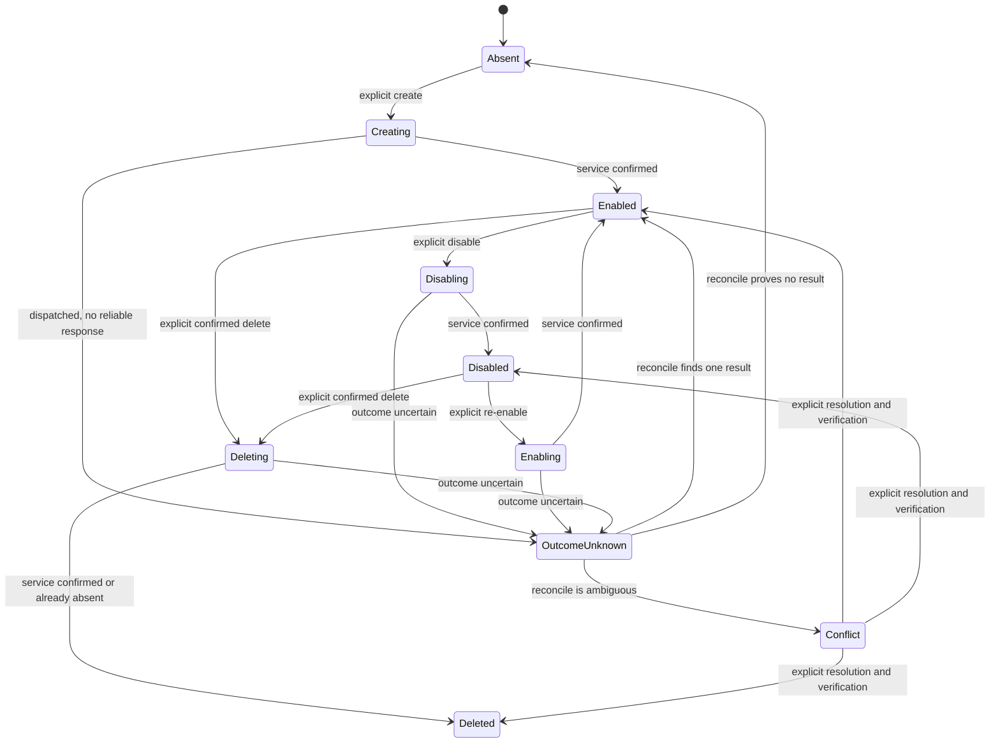

# First-class email aliases: product and interaction contract

Status: proposed product contract

Audience: product, design, client, SDK, security, and quality engineering

Normative language: **MUST**, **MUST NOT**, **SHOULD**, and **MAY** are requirements terms.

## Recorded base and evidence boundary

This document was authored on `docs/alias-product-contract` from the exact `origin/main` commit:

```text
1f881babc15eb7d3a88cad41730ce167d8e49a41
```

At authoring time, `HEAD`, `origin/main`, and their merge base all resolved to that commit. No fetch, checkout of an alias branch, schema change, dependency installation, build, browser, container, or test run was used to produce this contract.

The source baseline establishes the following facts:

- The current shared generator already presents forwarded email in the username/email generator, requires an explicit Generate action for remote forwarders, supports Copy, and stores connection settings through the generator service. See [username-generator.component.ts](../libs/tools/generator/components/src/username-generator.component.ts), [username-generator.component.html](../libs/tools/generator/components/src/username-generator.component.html), [forwarder-settings.component.ts](../libs/tools/generator/components/src/forwarder-settings.component.ts), and [forwarder.ts](../libs/tools/generator/core/src/engine/forwarder.ts).
- The current generator history stores generated credential values in encrypted, device-local user state. First-class aliases need an explicit history rule rather than inheriting this behavior accidentally. See [local-generator-history.service.ts](../libs/tools/generator/extensions/history/src/local-generator-history.service.ts).
- Existing forwarder metadata is designed around create-only generation and reports `autogenerate: false`; it does not define lifecycle, binding, reconciliation, or cross-device behavior. See [forwarder.ts](../libs/tools/generator/core/src/metadata/email/forwarder.ts).
- The development branches below prototype parts of a first-class experience. They are implementation evidence, not approved information architecture, copy, branding, or provider coupling.

| Read-only evidence ref | Exact tip | Product behavior evidenced |
| --- | --- | --- |
| `feat/alias-core-binding` | `0ece533db83deaa22c2f07bfdf757195cc59326b` | Stable generated-alias identity, encrypted login binding, and binding removal when the username changes |
| `feat/alias-web` | `a78437c68572c427d5e95ebb4f179efa918d1911` | Web list/detail lifecycle, recommendation, contact identity, and bound-login entry points |
| `feat/alias-browser` | `686e9b1288e0b26791d46749fc47baf1e70b3819` | Contextual one-click registration-field fill and browser alias management |
| `feat/alias-desktop` | `4e1a0a1635cf8bfa370bbb2762ff9184d05e3914` | Desktop lifecycle, activity, bound logins, and send/reply identity management |
| `feat/alias-migration-cli` | `383096e69b028013a88741045bc940f9d4a5fd37` | Deterministic dry-run/apply reconciliation and machine-readable reporting |
| `test/alias-e2e` | `29c19fbb4f6733ba45fd5bc9fad2f42cddf3624a` | Real-client create, bind, reuse, restart, and leakage assertions |
| `fix/alias-hardening` | `7fcfbfbafbb7eb395a861fd322dc7568f5449ca6` | Account/lock isolation, safe errors, bounded responses, redirect rejection, and stale async-result rejection |
| `integration/canonical-alias-sdk` | `79a59a7945cb1490104185e48f901348bcda2576` | Canonical lifecycle types, stable connection-scoped identity, reverse address delivery, and SDK security checks |
| `feat/alias-cross-device` | `113a59638afbe4379e259a2cec8fa38597445eb6` | Encrypted operation journal, causal merge, unknown outcomes, conflict detection, and multi-device convergence |

Relevant branch-only evidence can be inspected without changing refs with `git show <ref>:<path>`. Important examples are `libs/common/src/vault/alias-binding/alias-binding.ts`, `apps/browser/src/autofill/background/overlay.background.ts`, `apps/cli/src/tools/alias-reconciliation/alias-reconciliation.service.ts`, `libs/tools/generator/core/src/alias/simple-login-alias.security.spec.ts`, and `libs/common/src/tools/alias/alias-sync.ts` at the refs above.

This contract intentionally corrects prototype behavior that is not acceptable as a product invariant. In particular, it does not adopt provider branding, provider-specific fields, a dedicated navigation location, or a remote hostname lookup merely because an alias action becomes visible.

## Goal

Make an email alias a first-class, provider-neutral credential companion that a user can create with one explicit action in the same context as credential generation or registration autofill, then safely manage for its full lifetime on every password-manager client.

The password manager owns:

- the interaction, terminology, accessibility, and error contract;
- encrypted connections, stable alias identities, login bindings, labels, cached snapshots, operation intent, and conflict state;
- cross-device convergence and reconciliation;
- safe handoff of alias and send/reply addresses to forms, the clipboard, or a mail client.

The external alias service owns:

- address allocation and routability;
- forwarding state and mailbox delivery;
- remote deletion;
- creation and validity of send/reply identities.

## Scope and exclusions

In scope:

- Connect an eligible alias service without exposing its implementation in the product contract.
- Create, view, copy, use, label, disable, re-enable, delete, and reconcile aliases.
- Bind an alias to a login without making the email address itself the identity key.
- Create, view, copy, use, and remove a recipient-specific send/reply identity.
- Web, browser extension, desktop, CLI, and a normative future-mobile contract.
- Offline, partial-failure, unknown-outcome, and concurrent-device behavior.

Explicitly out of scope:

- personal account migration;
- `passmail.net`;
- Proton-specific recovery;
- provider branding or provider-named product states;
- behavior tied to one operator, service domain, API shape, or deployment topology;
- migration of legacy provider accounts or legacy settings as a user-facing feature;
- choosing visual styling, information architecture, navigation placement, branding, or a frontend framework;
- composing, storing, reading, or sending message bodies;
- changes to main, schema branches, refs, releases, or commercial source.

## Provider-neutral domain model

| Concept | Required meaning | Authority and storage |
| --- | --- | --- |
| Connection | One account-scoped authorization to an alias service, identified by a random stable `connection_id` | Secret material and the user-chosen connection label are end-to-end encrypted. A service endpoint or adapter identifier is implementation metadata, never user-visible identity. |
| Alias identity | Versioned tuple of `connection_id`, opaque remote alias ID, and canonical address | The opaque ID is the primary key. The address is a display and integrity field, not a join key. Stored only in encrypted account or vault state. |
| Alias record | Identity plus password-manager label, last confirmed remote lifecycle state, freshness, capabilities, and bound-login references | The service is authoritative for routability and lifecycle. The password manager is authoritative for label and bindings. |
| Login binding | Stable alias identity attached to a login whose username equals the alias address after normalization | End-to-end encrypted with the login. Hidden from ordinary custom-field UI and exports unless an export format explicitly supports it. |
| Send/reply identity | Recipient-scoped, service-issued address that lets the user's mailbox initiate or continue a conversation as the alias | Remote validity is authoritative. Recipient and address are encrypted locally and treated as sensitive. |
| Operation | Versioned intent with random operation ID, causal precondition, dispatch state, outcome, and safe error category | Encrypted durable journal. It MUST contain no provider credential, signed creation material, raw response, or URL query. |
| Tombstone | Durable evidence that an alias or binding was deleted or cleared | Retained long enough to prevent stale devices from resurrecting state. It contains only minimal encrypted identity and causal metadata. |

A provider integration qualifies as **first-class** only if it can meet the baseline create, list/get, enable/disable, delete, and send/reply identity semantics in this contract. An integration that can only generate an address remains a legacy forwarded-email generator and MUST NOT be presented as first-class.

Provider-specific optional capabilities MAY be implemented behind capability negotiation, but they MUST NOT alter the baseline meanings above or leak provider-specific controls into the shared contract.

## State model



Lifecycle, operation, freshness, and conflict are separate axes. A client MUST NOT flatten them into one optimistic status.

| Axis | Values | Contract |
| --- | --- | --- |
| Confirmed lifecycle | `enabled`, `disabled`, `deleted` | Last service-confirmed delivery state. `deleted` is represented locally by a tombstone. |
| Operation | `none`, `prepared`, `dispatched`, `outcome-unknown`, `failed` | `prepared` can be cancelled before dispatch. `dispatched` and `outcome-unknown` cannot be represented as completed. |
| Freshness | `current`, `stale` | `stale` means the client cannot currently verify the remote state. It does not change the last confirmed lifecycle. |
| Consistency | `clean`, `conflicted` | A conflict blocks automatic destructive or identity-changing work until reconciled or explicitly resolved. |

## Interaction contract

### Connect

- Connection setup MUST be account scoped and available before the first create.
- A single eligible connection, or a previously chosen default, enables one-click create. With no eligible connection, the same action leads to setup and MUST NOT claim that an alias was created.
- The product uses neutral terms such as “email alias service” and a user-chosen connection label. This document does not prescribe provider naming or setup layout.
- Validating a connection MUST use safe, bounded requests and MUST NOT persist or log plaintext credentials.

### Create in generation and autofill

- Web, browser extension, desktop, and future mobile MUST expose Create email alias in the same credential-generation context that can fill or set a login username.
- Browser extension and future mobile MUST also expose the action in a qualified registration email field through the existing autofill affordance. It MUST NOT appear for unrelated fields.
- One explicit action performs create, fills or selects the returned address, and retains its stable identity for the save flow. It MUST fill only the intended email/username field and MUST NOT change password, TOTP, or unrelated form fields.
- Rendering or focusing the action MUST NOT contact the alias service. After the user's explicit action, the client MAY send only a normalized hostname needed for creation. It MUST NOT send a full URL, path, query, fragment, page title, form contents, or browsing history.
- A remote success is not enough to claim a durable bound credential. The client first records recoverable operation state, then records the stable alias identity. If login saving fails, the new alias remains discoverable as an unbound alias; it is never silently deleted.
- A first-class alias MUST NOT be written to generic credential-generator history. Its lifecycle list is the recovery surface, and identity metadata must not cross the generator-history serialization boundary.
- Create is not available offline and MUST NOT be queued for surprise execution later. If a create request was dispatched and its outcome is unknown, the client MUST reconcile before any retry and MUST NOT blindly create again.

### Reuse and use

- “Use” means placing an existing alias address into a deliberate target: a credential username, a focused registration email field, or the clipboard.
- Reuse MUST be an explicit user decision. The client MUST NOT silently reuse one alias across unrelated credentials or sites.
- An alias may be offered for a new credential only when it is last-confirmed enabled. A stale cached alias requires a clear stale-state disclosure before use. Disabled, deleted, conflicted, or pending-delete aliases MUST NOT be recommended for new credentials.
- Normal autofill of an already saved login MUST continue to fill the saved username even if the bound alias is disabled or deleted. Alias lifecycle never rewrites or blocks the website account's login identifier.
- Filling or selecting an alias in a login attaches its stable binding. Editing the username to a different address clears that binding before save. Changing a label does not change the address or binding.

### View and copy

- Every interactive client MUST provide an observable list and detail representation containing address, password-manager label, confirmed lifecycle, freshness, pending/conflict state, and bound-login count when known.
- Copy is always explicit and copies only the chosen address. It uses the platform's existing clipboard-clearing policy and produces a non-secret success announcement without logging the value.
- Cached records remain viewable while offline when the vault is unlocked. The client MUST distinguish stale cache from provider-confirmed current state.
- A deleted alias remains visible from any bound login as a deleted binding/tombstone even if it no longer appears in the active alias list.

### Edit label

- Label is password-manager-owned, encrypted metadata and MUST work offline.
- Label edits sync through the normal encrypted account/vault path and do not depend on a provider-native note or name capability.
- Concurrent label edits use field-level causal merge. If neither edit causally follows the other, both values are retained as a conflict until the user chooses one; a client MUST NOT silently discard one.

### Disable and re-enable

- Disable and re-enable are remote delivery mutations. The client records intent before dispatch and shows a pending state until service confirmation.
- Pending disable MUST say, semantically, that forwarding may still be active. Pending re-enable MUST say that delivery is not yet confirmed.
- A queued, not-yet-dispatched mutation MAY be cancelled. A dispatched mutation cannot be presented as cancelled until reconciliation proves its state.
- Disable preserves the alias record, label, send/reply identities, and login bindings. Re-enable restores eligibility for new-credential use only after confirmation.

### Delete

- Delete requires an explicit confirmation that communicates permanence, remote effect, and the number of known bound logins. Exact wording and presentation remain a Mateo design decision.
- Delete never deletes a bound login, changes its username, or clears its password-manager history. It marks the alias binding as remotely deleted after confirmation.
- Service `not found` is a successful, idempotent delete outcome. A timeout or transport failure after dispatch is `outcome-unknown`, not success and not failure.
- Stale-device enable, edit, or bind operations MUST NOT resurrect a confirmed deletion. Delete-versus-update concurrency is a conflict unless causality proves the update happened before deletion.
- Associated send/reply identities become unusable when deletion is confirmed and remain only as minimal encrypted tombstones where required for convergence.

### Reconcile

- Reconciliation runs automatically after unlock/sync when pending or unknown work exists, after a remote-change notification, and before retrying any uncertain mutation. A manual action MUST also be available.
- Reconciliation compares stable identity first. Address-only matching is a repair heuristic, never primary identity.
- A one-to-one match between one live remote alias and one unbound login with the same normalized address MAY be proposed or applied. Duplicate aliases, duplicate logins, mismatched stable IDs, remote-missing records, local-missing records, concurrent retargets, and unknown create outcomes require explicit reporting.
- Default CLI reconciliation is read-only. Apply mode is explicit, idempotent, and changes only unambiguous bindings or operations whose desired state can be safely verified.
- Every reconcile report has a version, mode, counts, exact matches, planned/applied/failed changes, missing records, duplicates, conflicts, and unknown outcomes. Machine-readable output is deterministic and contains no secret material.

### Send and reply identity

- Replying to forwarded mail remains a mail-service/mail-client behavior; the password manager does not read or proxy message content.
- To initiate a conversation, the user selects an enabled alias and supplies a recipient. The password manager requests or retrieves a recipient-scoped send/reply identity, then lets the user copy it or hand it to a mail client.
- Recipient input, the returned send/reply address, block state, and last-confirmed validity are sensitive and encrypted. They MUST NOT enter telemetry, logs, generator history, or a URL except the explicit local mail-client handoff.
- A send/reply identity MUST expose view, copy, and remove. If the provider supports blocking, block/unblock is an optional negotiated capability and must use the same pending/outcome rules as alias lifecycle mutations.
- The password manager MUST NOT compose, persist, inspect, or transmit subject/body content. Whether a platform offers Copy only or also opens a pre-addressed local composer is a Mateo interaction decision.

## Offline and failure behavior

| Situation | Required user-observable behavior | Retry rule |
| --- | --- | --- |
| Offline before create/send-identity dispatch | No remote object is claimed or queued; cached aliases remain viewable | User retries explicitly when online |
| Offline label edit | Label changes locally with unsynced status | Normal encrypted sync retries |
| Offline disable, enable, or delete | Intent may be queued as `prepared`; remote lifecycle remains unchanged and visibly pending | Dispatch on reconnect unless cancelled before dispatch |
| Failure before dispatch | Operation is failed or remains prepared; no remote effect is implied | Safe explicit retry |
| Failure after dispatch | Operation becomes `outcome-unknown` | Reconcile first; no blind create retry |
| Rate limit | Existing data remains available; retry time is shown when safely supplied | Automatic retry only after the bounded retry time and only for idempotent reads |
| Authentication rejected | Cached data remains readable; mutations stop and connection needs attention | Never retry with the same rejected credential automatically |
| Remote item absent | Reconcile bindings and tombstone state | Delete treats absence as success; other actions require user-visible repair |
| Conflicting devices | Both causal events are retained; destructive/identity-changing work pauses | Explicit resolution or provably safe reconciliation |

## Error taxonomy

All clients consume stable, provider-neutral codes. UI text is localized, safe, and actionable. Raw provider response bodies, tokens, endpoints, alias values, recipients, and request URLs MUST NOT be rendered or logged.

| Code | Meaning | User action and retry |
| --- | --- | --- |
| `vault-locked` | Encrypted alias state is unavailable | Unlock; no remote request is attempted |
| `connection-missing` | No eligible connection exists | Configure or choose a connection |
| `authentication-rejected` | Credential is missing, expired, or rejected | Repair the connection; no automatic retry |
| `permission-denied` | Service refuses this account or operation | Explain that the action is unavailable; do not loop |
| `capability-unsupported` | The connection cannot satisfy a required/optional action | Hide optional actions or explain why required first-class qualification failed |
| `invalid-input` | Address, label, recipient, endpoint, or option fails local validation | Keep input and focus the failing field |
| `not-found` | Remote alias or send/reply identity is absent | Reconcile; delete may complete idempotently |
| `quota-exhausted` | Service cannot create more aliases/identities | Preserve state and offer connection management; no automatic retry |
| `rate-limited` | Service asks the client to slow down | Show bounded retry time; reads may retry later |
| `offline` | Network is known unavailable before dispatch | Apply the offline table above |
| `timeout` | No response before the bounded deadline | If dispatched, mark outcome unknown; otherwise safe retry |
| `service-unavailable` | DNS, transport, or service failure | Preserve cache; reconcile before uncertain retry |
| `invalid-response` | Response is malformed, oversized, redirected unsafely, or violates schema | Stop, show safe error, and retain evidence without raw body |
| `outcome-unknown` | A mutation may have reached the service | Block blind retry and reconcile |
| `sync-conflict` | Concurrent causal states cannot be merged safely | Present the affected fields/actions for resolution |
| `local-security-failure` | Encryption, integrity, or secure persistence failed | Do not dispatch if not already sent; lock affected mutations and surface recovery guidance |

## Cross-device consistency

- Each device has a random replica ID. Each mutation has a random operation ID and causal precondition.
- The encrypted journal is append-only until compacted with tombstone and conflict semantics preserved. Merge is deterministic, commutative, associative, and idempotent.
- Provider secrets never enter events. A custom-create signed suffix, bearer credential, request header, or raw response is forbidden journal material.
- Remote lifecycle and password-manager metadata merge at field granularity. Destructive state, alias identity, and login retarget conflicts never use silent last-writer-wins.
- A client writes durable intent before a remote mutation, records dispatch before awaiting the result, and records acknowledgement, safe failure, or unknown outcome afterward.
- Create uses provider idempotency when available. Without it, an unknown create is resolved by a bounded, identity-safe provider query; ambiguity becomes conflict.
- Lock, logout, account switch, or profile removal clears plaintext alias, recipient, credential, recommendation, and in-flight operation state from memory. Late async responses from an old account/session are discarded.
- A confirmed change triggers normal encrypted sync. Clients without push support poll or refresh on foreground/unlock. Manual refresh is always available.

## Accessibility contract

- All actions are reachable and operable by keyboard, switch, touch, and screen reader using native platform semantics.
- Create/use in autofill participates in the existing focus model and is announced with whether it will create or use an address. The address is not announced before it is available.
- Loading, stale, pending, failed, conflicted, enabled, disabled, and deleted are expressed in text and programmatic state, never by color alone.
- Success, failure, and external-state changes use an appropriate polite or assertive live announcement without stealing focus. Focus returns to a predictable control after dialogs and deletions.
- Forms expose programmatic labels, descriptions, validation association, and error focus. Destructive confirmation names the affected alias without relying on visual position.
- Lists, details, and pagination retain logical reading order at zoom/reflow. No action requires hover, drag, precise pointer movement, or a timeout.
- Reduced motion and platform text scaling are honored. CLI output has stable plain-text and JSON forms and never relies on ANSI color for meaning.

## Privacy and security invariants

1. Provider credentials, aliases, labels, recipients, send/reply addresses, stable IDs, hostnames, and bindings are sensitive user data.
2. Credentials are end-to-end encrypted at rest and in sync, scoped to one password-manager account and one connection, and never stored in plaintext browser/desktop profiles.
3. No secret or sensitive value appears in logs, analytics, crash reports, exception messages, support bundles, DOM attributes, notification payloads, or generator history.
4. Allowed telemetry is limited to coarse operation kind, platform, safe error category, and success/failure when product telemetry policy permits it. It contains no stable connection/device/alias identifier, provider name, hostname, address, label, or recipient.
5. Service contact happens only after an explicit user action or a user-authorized background reconcile of already-known identities. Merely opening/focusing a generator or form does not disclose browsing context.
6. Release connections require authenticated HTTPS, prohibit URL credentials/query/fragment, prevent authenticated cross-origin redirects, use no-store semantics, enforce request deadlines and response-size bounds, and validate every response before use.
7. Login binding is accepted only when login type, generated value, stored username, identity address, and connection-scoped opaque ID are consistent. A malformed reserved field is hidden and ignored, never rendered as a custom field.
8. Existing credential autofill remains available after alias disable/delete because the saved username is required to access the website account.
9. Destructive and externally visible state is never reported as complete before service confirmation or reconciliation.
10. Any first-class provider adapter must pass the same contract suite; no operator/domain special case may bypass these invariants.

## Platform capability matrix

Legend: **Required** means release-blocking for a first-class client; **Equivalent** means the platform provides the same outcome through its native interaction model; **Not applicable** means the platform cannot own that surface.

| Capability | Web | Browser extension | Desktop | CLI | Future mobile |
| --- | --- | --- | --- | --- | --- |
| Connect and inspect connection health | Required | Required | Required | Equivalent | Required |
| Create in credential generator | Required | Required | Required | Equivalent command | Required |
| One-click registration-field create/use | Not applicable | Required | Not applicable | Not applicable | Required |
| View/search/filter alias records | Required | Required | Required | Equivalent structured output | Required |
| Copy address | Required | Required | Required | Equivalent stdout/clipboard action | Required |
| Use in new/edited credential with stable binding | Required | Required | Required | Equivalent command/input | Required |
| Edit password-manager label | Required | Required | Required | Equivalent command | Required |
| Disable and re-enable | Required | Required | Required | Equivalent command | Required |
| Delete with bound-login protection | Required | Required | Required | Equivalent explicit destructive command | Required |
| View bound logins and deleted binding state | Required | Required | Required | Equivalent structured output | Required |
| Create/view/copy/remove send/reply identity | Required | Required | Required | Equivalent commands | Required |
| Cached offline view/copy and offline label | Required | Required | Required | Equivalent unlocked cache access | Required |
| Pending, unknown, stale, and conflict states | Required | Required | Required | Equivalent status and exit code | Required |
| Automatic reconcile and encrypted convergence | Required | Required | Required | Required on unlock/sync invocation | Required |
| Manual reconcile report | Required summary | Required summary | Required summary | Required full report | Required summary |
| Accessible keyboard/screen-reader/touch behavior | Required | Required | Required | Equivalent accessible output | Required |

This matrix chooses capabilities, not navigation, screen hierarchy, responsive layout, styling, copywriting, or framework.

## Acceptance criteria

- **AC-01:** With one eligible configured connection and an unlocked vault, one explicit Create email alias action from a generator returns one address, fills/selects it, and retains one stable identity for login save.
- **AC-02:** Opening or focusing the generator/autofill surface produces no alias-service network request. The post-click request contains at most a normalized hostname and no full URL or form data.
- **AC-03:** A generated alias saved unchanged as a login username receives an encrypted binding; changing the username before or after save removes the binding without deleting the alias.
- **AC-04:** A first-class alias and its metadata do not appear in generic generator history, logs, telemetry, or crash diagnostics.
- **AC-05:** Create success followed by login-save failure leaves the alias visible and unbound; it is not leaked, lost, duplicated, or silently deleted.
- **AC-06:** List/detail exposes confirmed lifecycle, freshness, pending/conflict state, label, address, and known binding count consistently across interactive clients.
- **AC-07:** Copy copies only the requested address, follows clipboard-clearing policy, and announces success accessibly without exposing the value in logs.
- **AC-08:** Offline label editing succeeds locally and converges after encrypted sync. Concurrent labels are not silently discarded.
- **AC-09:** Disable and re-enable remain pending until service confirmation. Existing saved-login autofill continues in enabled, disabled, and deleted alias states.
- **AC-10:** Delete requires confirmation, preserves every login and username, produces a tombstone, and treats remote absence as success.
- **AC-11:** A network break after create dispatch yields `outcome-unknown`; restart and another device do not issue another create until reconciliation resolves the first.
- **AC-12:** Reconciliation is deterministic and idempotent, uses stable identity first, auto-applies only unambiguous work, and reports duplicates/missing/conflicts/unknown outcomes.
- **AC-13:** Two devices making concurrent enable/delete, binding-retarget, or label edits converge or expose a resolvable conflict; a stale device cannot resurrect deletion.
- **AC-14:** Lock, logout, account switch, and process restart remove plaintext transient state and ignore late results from the prior session/account.
- **AC-15:** Unsafe endpoint, redirect, oversized/malformed response, rejected authentication, rate limit, offline, timeout, and permission errors map to the provider-neutral taxonomy with no raw remote text.
- **AC-16:** An enabled alias can create a recipient-scoped send/reply identity, copy/use it, and remove it without the password manager accessing message content.
- **AC-17:** All required actions and states pass keyboard, screen-reader, text scaling/reflow, focus, and non-color status checks.
- **AC-18:** CLI defaults reconciliation to dry-run, emits versioned deterministic JSON, separates diagnostics from data output, and requires explicit authorization for mutations.
- **AC-19:** The same encrypted record, operation, conflict, and binding semantics are used by web, extension, desktop, CLI, and future mobile; platform UI does not fork the domain model.
- **AC-20:** No acceptance path depends on a named provider, operator, domain, personal-account migration, `passmail.net`, or Proton-specific recovery.

## Observable end-to-end test matrix

Platform abbreviations: W web, B browser extension, D desktop, C CLI, M future mobile.

| ID | Platforms | Setup and action | Observable assertions |
| --- | --- | --- | --- |
| E2E-01 | W, B, D, M | Open generator while unlocked; do not activate alias action | No alias-service request; action is keyboard/screen-reader reachable |
| E2E-02 | W, B, D, M | Activate create once with one configured connection | Exactly one create request; request context is normalized hostname only; one address is selected/filled |
| E2E-03 | B, M | Activate from a qualified empty registration email field | Only that field changes; password and unrelated fields do not; focus/announcement is correct |
| E2E-04 | B, M | Attempt from a non-email or non-registration field | Alias action is absent and no service request occurs |
| E2E-05 | W, B, D, M | Create then save login unchanged | Server-restored login has the same username and encrypted stable binding; reserved metadata is not visible |
| E2E-06 | W, B, D, M | Create then edit username before save | Login saves edited username with no alias binding; created alias remains listed as unbound |
| E2E-07 | W, B, D, M | Force login save failure after confirmed create | Alias is recoverable in list; retrying login save creates no second alias |
| E2E-08 | W, B, D, C, M | View, search, and copy an enabled alias | Same address/label/state across clients; copy/stdout contains only requested data; diagnostics contain none |
| E2E-09 | W, B, D, C, M | Edit label offline, restart, reconnect, and sync | Local label survives restart, syncs encrypted, and appears on a second device |
| E2E-10 | W, B, D, C, M | Disable, then re-enable | Pending state precedes confirmation; provider delivery state and every client converge |
| E2E-11 | W, B, D, M | Autofill a saved login while its alias is disabled | Saved username still fills; alias is not recommended for a new credential |
| E2E-12 | W, B, D, C, M | Delete an alias bound to multiple logins | Confirmation exposes binding count; remote alias is absent; all logins/usernames survive with deleted-binding state |
| E2E-13 | W, B, D, C, M | Delete an already absent alias | Operation completes idempotently without recreating or changing a login |
| E2E-14 | W, B, D, C, M | Drop connection before create dispatch | No remote alias and no queued create; explicit retry is available |
| E2E-15 | W, B, D, C, M | Drop response after create reaches service, then restart | State is outcome unknown; no blind second create; reconcile resolves one/none/ambiguous correctly |
| E2E-16 | W, B, D, C, M | Queue disable offline, then cancel before dispatch | Provider remains enabled and journal records no dispatched completion |
| E2E-17 | W, B, D, C, M | Queue delete offline, reconnect without cancel | UI remains pending until provider confirmation; tombstone then converges |
| E2E-18 | W, B, D, C, M | Concurrent enable and delete from two devices | No silent last-writer winner; conflict or causally correct deletion; stale device cannot resurrect |
| E2E-19 | W, B, D, C, M | Concurrent labels from two offline devices | Both values survive merge and resolution converges on all clients |
| E2E-20 | C, W, B, D, M | Seed exact, unbound, duplicate, missing, mismatched, and unknown cases; reconcile twice | Dry run is unchanged; apply changes only safe cases; second apply is a no-op; summaries and details are deterministic |
| E2E-21 | W, B, D, C, M | Reject credentials, return 403/404/429/5xx, malformed/oversized data, unsafe redirect, and timeout | Stable safe error codes/messages; bounded retry metadata; no raw body, endpoint, token, alias, or recipient in output/logs |
| E2E-22 | W, B, D, C, M | Create send/reply identity for a recipient, deliver inbound mail, reply, copy, then remove identity | Inbound and reply preserve alias identity; password manager observes only identity lifecycle, never content |
| E2E-23 | W, B, D, M | Lock/account-switch while recommendation/create is in flight | Transient state clears; late result is discarded; no value crosses accounts |
| E2E-24 | W, B, D, C, M | Inspect persisted profiles, sync payloads, logs, telemetry, and diagnostics after full lifecycle | Provider credentials and sensitive values exist only in approved encrypted stores; generic generator history has no alias |
| E2E-25 | W, B, D, M | Run full workflow with keyboard/screen reader, 200% text, reduced motion, and high contrast | Logical focus/order, announced states/errors, reflow, and non-color meaning satisfy the accessibility contract |

Real-service tests MAY use a provider-specific fixture internally, but assertions and reusable contract fixtures MUST target the neutral domain behavior. Production credentials and personal accounts are forbidden test inputs.

## Decisions reserved for Mateo during UI/UX design

These are product decisions, not engineering gaps. Engineering can proceed against the invariant boundary in the last column.

| Decision | Mateo chooses | Invariant already locked |
| --- | --- | --- |
| Information architecture | Whether management lives in Tools, Vault, generator, login detail, or a combination | Every required capability remains reachable on each platform; no branch prototype decides placement |
| Visual system | Layout, density, responsive composition, iconography, emphasis, and motion | Semantic states, keyboard order, reflow, and non-color meaning remain required |
| Naming and branding | Final feature name, connection terminology, and user-facing copy | Domain model and errors remain provider neutral; this contract supplies no provider branding |
| Create versus reuse emphasis | Whether contextual UX foregrounds New alias, Use existing, or a choice | No silent cross-site reuse, no remote lookup before explicit action, and one-click create when eligibility is unambiguous |
| Multiple connections | Default-selection and chooser behavior | One-click is allowed only with one eligible/default connection; stable identity always includes connection scope |
| List/detail content hierarchy | Which metadata, activity, binding, and status appears first | Required states and binding impact remain observable and accessible |
| Destructive confirmation | Exact wording, step count, and whether policy-driven reprompt is used | Permanence and bound-login impact are communicated; delete never changes a login |
| Offline presentation | Copy and placement of stale, queued, pending, and unknown states | Those states remain distinct and cannot be called complete optimistically |
| Send/reply handoff | Copy-only, local composer launch, or both per platform | No message content handling; recipient-scoped identity remains explicit and encrypted |
| Mobile interaction | Generator, keyboard accessory, share sheet, credential editor, and management placement | Future mobile implements the same domain, privacy, offline, a11y, and convergence contract |
| Optional creation controls | Whether to expose custom local parts, address modes, or mailbox choice | Baseline one-click create works without provider-specific UI; optional controls are capability negotiated |

## Engineering invariants locked now

1. Alias identity is connection-scoped and opaque; address-only identity is forbidden.
2. First-class state is provider neutral and shared across clients; adapters translate it.
3. All sensitive data is encrypted, account isolated, bounded, and excluded from logs/telemetry/history.
4. Browsing context is disclosed only after explicit action and is reduced to the minimum hostname.
5. Durable intent precedes remote mutation; success follows acknowledgement; uncertain dispatch requires reconciliation.
6. Non-idempotent create is never blindly retried after an unknown outcome.
7. Cross-device merge preserves causality, tombstones, and conflicts; destructive or identity conflicts have no silent last-writer winner.
8. Login binding is stable, hidden, integrity checked, cleared on username mismatch, and never causes login deletion or username rewrite.
9. Disabled/deleted aliases are not offered for new credentials, while existing saved-login autofill continues.
10. Provider-neutral error, accessibility, CLI-output, and end-to-end contract suites are release gates for every first-class adapter and client.
