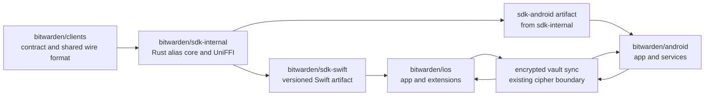

# First-class email aliases: mobile integration map

Status: implementation-ready plan, based on read-only repository inspection on 2026-08-13.

## Recorded base and scope

This worktree was created from and still has the following merge base with `origin/main`:

| Item | Recorded value |
| --- | --- |
| Repository | `mateoltd/bitwarden-clients` |
| Branch | `docs/mobile-alias-integration` |
| Exact `origin/main` base | `1f881babc15eb7d3a88cad41730ce167d8e49a41` |
| Base authored | `2026-08-07T15:21:20-04:00` |
| Base subject | `[CL-51] create file upload component (#20899)` |

The repository boundary is decisive: the root [README](../README.md) says this repository contains all Bitwarden clients except the mobile applications and links to the separate public [iOS](https://github.com/bitwarden/ios) and [Android](https://github.com/bitwarden/android) repositories. Consequently, no production mobile implementation belongs in this branch.

This plan does not choose visual design, application framework, alias provider, personal migration behavior, custom-domain behavior, branding, information architecture, or product policy. References to SwiftUI and Compose describe the inspected applications; they are not new framework decisions.

## Evidence snapshot

The inventory is intentionally pinned so later movement is visible rather than silently changing the conclusions.

| Repository or contract | Commit inspected | Why it matters |
| --- | --- | --- |
| `bitwarden/clients` base | `1f881babc15eb7d3a88cad41730ce167d8e49a41` | This worktree and the non-mobile client boundary |
| Provider-neutral contract | `6b58f7b8c4678dce5c5a3f92f7d028ef17c47f6e` | Required behavior, state model, and acceptance cases |
| Canonical alias SDK integration branch | `79a59a7945cb1490104185e48f901348bcda2576` | Clients-side SDK package pin and generated TypeScript surface |
| Alias SDK source commit | `8e7a52bcb4ca52eba28f0cc7ec574d784abc0fc7` | Rust core plus UniFFI and WASM bindings |
| `bitwarden/ios` main | `7d9c4a779e0985fb01db4652d744c0728724b8ba` | Current native iOS architecture and extension targets |
| `bitwarden/android` main | `5c0764e72ba821d9277a3fdd23c09131fba19c57` | Current native Android architecture and service targets |
| `bitwarden/sdk-internal` main | `99ffb6ef5f07c1b344f0e8ceb4da37f27482e9f6` | Current SDK integration boundary at inspection time |

The provider-neutral [product contract](https://github.com/mateoltd/bitwarden-clients/blob/6b58f7b8c4678dce5c5a3f92f7d028ef17c47f6e/docs/email-alias-product-contract.md) defines aliases as a connection, alias record, encrypted login binding, send/reply identity, and durable operation journal. It requires one explicit create action in generator/autofill, no network request on field focus, no surprise-queued offline creates, deterministic reconciliation of unknown outcomes, accessible state announcements, and ordinary encrypted sync.

The pushed prototype branches provide useful evidence without becoming an implementation mandate:

- [The hidden binding field](https://github.com/mateoltd/bitwarden-clients/blob/0ece533db83deaa22c2f07bfdf757195cc59326b/libs/common/src/vault/alias-binding/alias-binding.ts) is materialized before cipher encryption, excluded from ordinary fields, and cleared if the username no longer matches.
- [The journal model](https://github.com/mateoltd/bitwarden-clients/blob/113a59638afbe4379e259a2cec8fa38597445eb6/libs/common/src/tools/alias/alias-sync.ts) carries operation state and vector clocks without plaintext credentials.
- [The encrypted carrier prototype](https://github.com/mateoltd/bitwarden-clients/blob/113a59638afbe4379e259a2cec8fa38597445eb6/libs/common/src/vault/alias-connection/alias-connection-vault.ts) uses ordinary cipher sync for connection material and journals. Mobile should consume the settled shared format, not invent a parallel mobile-only schema.
- The alias branches are independent children of the recorded base. They were inspected through their existing refs without checking them out or modifying them. Their exact tips are emitted by the inventory script.

The SDK source commit contains the [alias crate](https://github.com/bitwarden/sdk-internal/tree/8e7a52bcb4ca52eba28f0cc7ec574d784abc0fc7/crates/bitwarden-alias) and a [UniFFI client surface](https://github.com/bitwarden/sdk-internal/blob/8e7a52bcb4ca52eba28f0cc7ec574d784abc0fc7/crates/bitwarden-uniffi/src/alias.rs) for create, list, search, update, lifecycle operations, domains, mailboxes, reverse/send identities, stable references, bindings, migration, and reconciliation. That is the correct shared native boundary. It does not mean the bindings have shipped to the versions consumed by the mobile apps.

At the snapshot, [iOS pins](https://github.com/bitwarden/ios/blob/7d9c4a779e0985fb01db4652d744c0728724b8ba/project-common.yml#L15-L17) `sdk-swift` commit `3dbc27249f48fcb88c56739ece52e2335701de0b`, whose artifact identifies internal SDK revision `10ba9cbb21cb201988b7e54e68df13678ebcaa5f`; [Android pins](https://github.com/bitwarden/android/blob/5c0764e72ba821d9277a3fdd23c09131fba19c57/gradle/libs.versions.toml#L32) `com.bitwarden:sdk-android` version `3.0.0-8157-eb825d59`, sourced from `eb825d59e24605487d2b8c06286ded0f103a4990`. Both predate alias SDK commit `8e7a52b...`. The alias commit was also not on the then-current `sdk-internal` main line. Publishing supported Swift and Kotlin artifacts containing the alias API is therefore the first release gate, not mobile UI work.

## Ownership map

No dedicated server or schema change is required for the baseline if the settled encrypted carrier and existing cipher sync remain authoritative. A future dedicated server API or push type would belong in `bitwarden/server` and is outside this plan.

## Platform readiness matrix

`Ready` means the current platform has an integration seam. It does not mean alias behavior already exists.

| Capability | iOS evidence and plan | Android evidence and plan | Owner | Readiness or gate |
| --- | --- | --- | --- | --- |
| Shared alias operations | `Client.aliases()` must arrive through `sdk-swift`/UniFFI. Add a native repository adapter returning the contract's typed lifecycle, freshness, consistency, and operation states. | `com.bitwarden.sdk` must publish the same UniFFI API. Add a data-layer source and repository adapter with the same domain outcomes. | `sdk-internal`, artifact pipeline, then both mobile repos | Blocked on supported native SDK artifacts |
| Main-app creation | Extend the current [generator processor](https://github.com/bitwarden/ios/blob/7d9c4a779e0985fb01db4652d744c0728724b8ba/BitwardenShared/UI/Tools/Generator/Generator/GeneratorProcessor.swift) and repository path; creation begins only after an explicit action and normalizes only the selected service hostname. | Extend the current generator [ViewModel](https://github.com/bitwarden/android/blob/5c0764e72ba821d9277a3fdd23c09131fba19c57/app/src/main/kotlin/com/x8bit/bitwarden/ui/tools/feature/generator/GeneratorViewModel.kt), repository, and SDK source path with the same semantic action and result states. | `ios`, `android` | Ready after SDK gate |
| Login save binding | Persist the stable alias reference in the settled hidden encrypted cipher field only when the saved username matches; clear it on mismatch. Preserve ordinary save behavior when binding fails. | Same rule in add/edit and autofill-save flows. | Both mobile repos, shared format owned here/SDK | Format must settle before mobile merge |
| Reuse and autofill | Existing credential-provider list can reuse bound aliases. Generic text insertion on iOS 18+ can open the common alias flow and complete with the chosen address. | Existing [AutofillService](https://github.com/bitwarden/android/blob/5c0764e72ba821d9277a3fdd23c09131fba19c57/app/src/main/kotlin/com/x8bit/bitwarden/data/autofill/BitwardenAutofillService.kt) can offer an authenticated dataset that opens the common alias flow, then returns a dataset for the target email/username field only. | Both mobile repos | Ready with OS-specific qualification limits |
| Registration-field qualification | A credential-provider text-insertion request supplies service identifiers but not a browser DOM-equivalent field model. Offer the explicit alias flow without claiming automatic empty-email-field qualification. Safari Action Extension may qualify web forms where its existing page details permit it. | AutofillService receives view structure and hints, so the parser can require a visible, editable email/username registration field and avoid password, search, OTP, and arbitrary text fields. | Both mobile repos | iOS has a documented platform limitation; outcome parity remains possible |
| Credential provider | [CredentialProviderExtensionDelegate](https://github.com/bitwarden/ios/blob/7d9c4a779e0985fb01db4652d744c0728724b8ba/BitwardenShared/UI/Autofill/Application/CredentialProviderExtensionDelegate.swift) already handles passwords, passkeys, OTP, and generic text insertion. Route alias results through the existing request completion boundary. | [BitwardenCredentialProviderService](https://github.com/bitwarden/android/blob/5c0764e72ba821d9277a3fdd23c09131fba19c57/app/src/main/kotlin/com/x8bit/bitwarden/data/credentials/BitwardenCredentialProviderService.kt) handles Credential Manager requests. Alias selection belongs inside password-credential creation UI, not as a new credential type. | Both mobile repos | Ready after SDK gate |
| Passkeys | Leave passkey registration/assertion request and completion paths untouched. A mixed credential UI may expose alias choice only for a login username; cancel or late alias results must never complete a passkey request. | Preserve FIDO2/Credential Manager request payloads and results. Passkey-only flows never invoke alias code. | Both mobile repos | Regression gate |
| Share sheets | The inbound [Share extension](https://github.com/bitwarden/ios/blob/7d9c4a779e0985fb01db4652d744c0728724b8ba/BitwardenShareExtension/ShareViewController.swift) and Action extension are separate targets. Receiving shared content currently routes to Send or browser action behavior. Any alias entry must explicitly route to the common use case and must not contact a provider on receipt. Outbound send/reply uses an explicit local system handoff with the recipient-scoped address only. | `ACTION_SEND` currently routes shared data through the app to Send. Any alias entry requires an explicit routing choice and the same no-contact-on-receipt rule. Outbound send/reply uses an explicit local chooser intent with only the scoped address. | Both mobile repos | Engineering seam exists; placement is intentionally undecided |
| Secure storage | [KeychainRepository](https://github.com/bitwarden/ios/blob/7d9c4a779e0985fb01db4652d744c0728724b8ba/BitwardenShared/Core/Auth/Services/KeychainRepository.swift) and the app-group [DataStore](https://github.com/bitwarden/ios/blob/7d9c4a779e0985fb01db4652d744c0728724b8ba/BitwardenShared/Core/Platform/Services/Stores/DataStore.swift) are available to app/extension targets. Keep the encrypted vault carrier authoritative; Keychain may protect keys or an account-scoped local cache, never the sole cross-device credential copy. | [KeystoreManager](https://github.com/bitwarden/android/blob/5c0764e72ba821d9277a3fdd23c09131fba19c57/core/src/main/kotlin/com/bitwarden/core/data/manager/encryption/KeystoreManager.kt) protects local keys and encrypted preferences protect account secrets. Keep the encrypted vault carrier authoritative and isolate any local cache by account. | Both mobile repos | Ready once carrier format settles |
| Sync and background work | [SyncService](https://github.com/bitwarden/ios/blob/7d9c4a779e0985fb01db4652d744c0728724b8ba/BitwardenShared/Core/Vault/Services/SyncService.swift), push handling, unlock, foreground, and manual sync are reliable hooks. Reconcile there and use granted background time opportunistically; iOS does not guarantee prompt background execution. | [VaultSyncManager](https://github.com/bitwarden/android/blob/5c0764e72ba821d9277a3fdd23c09131fba19c57/app/src/main/kotlin/com/x8bit/bitwarden/data/vault/manager/VaultSyncManager.kt), push, unlock, foreground, and manual sync are hooks. Do not add a special guaranteed scheduler assumption; any later WorkManager use must remain opportunistic and constrained. | Both mobile repos | Ready after journal integration |
| Offline behavior | Read from the last encrypted snapshot. Local label edits sync normally. Creation and send identity are unavailable offline. A lifecycle mutation may be prepared only when the contract permits it. Unknown dispatched creates reconcile before retry. | Same state machine and recovery behavior. Preserve cached vault data while surfacing stale/no-network state. | SDK plus both mobile repos | Shared conformance tests required |
| Deep links | Extend the existing `AppRoute`/URL parser with a non-secret alias destination, defer navigation until the correct account is unlocked, and reject malformed or cross-account input. Do not put address, credential, mailbox, token, or operation payload in the URL. | Extend the existing manifest/MainViewModel route handling under the same rules. Internal pending intents remain explicit and immutable where supported. | Both mobile repos | Route name and placement intentionally undecided |
| Accessibility | Expose lifecycle, stale, conflict, offline, in-progress, failure, and retry/reconcile results to VoiceOver; preserve Dynamic Type, focus order, external keyboard, and Switch Control behavior. | Expose the same semantic states to TalkBack; preserve font scaling, traversal order, keyboard/switch access, and accessibility autofill behavior. | Both mobile repos | Behavioral acceptance gate; no visual design decision |
| Release | Update the pinned `sdk-swift` revision only after the alias commit is on a supported SDK line; build app plus Autofill, Share, Action, and Notification targets in the iOS repository. | Update the published `sdk-android` version only after the same SDK gate; build app and exercise AutofillService/Credential Manager variants in the Android repository. | SDK and mobile release owners | Separate independently revertible releases |

Apple documents the generic text provider callback and the required `ProvidesTextToInsert` capability in [AuthenticationServices](https://developer.apple.com/documentation/authenticationservices/ascredentialproviderviewcontroller/prepareinterfaceforuserchoosingtexttoinsert%28%29?language=objc); the inspected iOS extension already declares that capability. Android documents authenticated and inline autofill datasets in [Dataset](https://developer.android.com/reference/android/service/autofill/Dataset) and the password/passkey provider boundary in [Credential Manager](https://developer.android.com/identity/sign-in/credential-provider).

## One-interface behavior

“One interface” is a behavioral contract, not identical screen layout. Every eligible entry point calls one account-scoped alias use case and observes the same state machine:

1. The host supplies surface, account, optional login/cipher, and an optional service identifier. It does not supply provider-specific types.
2. Merely focusing a field, opening an extension, receiving a share, or resolving a deep link performs no provider request.
3. The user explicitly chooses create or reuse. Only then may the use case normalize a hostname and call the SDK.
4. A successful create returns an address and stable alias reference. The host inserts the address and stages the reference for the matching login save.
5. Login persistence is still successful if alias binding cannot be written; the UI reports the binding failure separately and offers deterministic recovery.
6. Cancel, lock, account change, extension timeout, and stale callbacks clear the pending result and cannot complete another request.

Use the same domain vocabulary and error mapping on both platforms: lifecycle, operation phase, freshness, consistency, retryability, and required recovery. Native processors/ViewModels translate those outcomes into their existing presentation state. Provider names, credentials, capabilities, and error payloads do not escape the SDK adapter.

### Surface-specific rules

- Main generator and login editor: create/reuse, insert the address, and stage binding on save. Do not add alias creation to generic generator history.
- iOS Credential Provider: use generic text insertion for an explicit address picker where available; use the existing credential list/save flow for login binding. The OS does not provide enough context to promise browser-style registration-field qualification in every app.
- Android AutofillService: return an authenticated dataset for one qualified email/username field. Do not fill other partitions or trigger creation while building suggestions.
- Credential Manager and passkeys: an alias can supply the username of a password credential being created. It is not a credential type and never changes passkey challenge, RP ID, user handle, attestation, assertion, cancellation, or completion data.
- Inbound shares: preserve current Send routing unless an explicit alias route is selected. Shared text or URLs are untrusted input; parse locally, strip path/query/fragment before a later explicit action, and never accept credentials or operation state.
- Outbound send/reply: obtain the recipient-scoped address only after an explicit action, hand it locally to an OS compose/chooser surface, and never prepopulate message content. Failure or cancellation leaves no queued send.
- Deep links: carry only a route and an opaque local record reference if needed. Resolve after unlock and account selection. Reject provider URLs, secrets, raw alias addresses, and operation commands.

## Storage, sync, and offline state

The authoritative connection identity, provider credential, alias metadata, operation journal, and tombstones must remain end-to-end encrypted through the settled shared vault representation. The native secure-storage facilities protect account keys and may hold a wrapped, account-scoped local cache for extension startup, but they must not create an unsynced source of truth. Login bindings use the hidden encrypted cipher field.

Extension/process caches must be versioned by account and snapshot revision. On lock, logout, account switch, memory warning, or request completion, discard decrypted aliases, credentials, operation payloads, and generated addresses that are not part of a saved cipher. Logs, analytics, crash reports, notification payloads, deep links, and clipboard metadata must exclude provider credentials and raw operation responses.

| Starting condition | Permitted behavior | Required user-visible outcome |
| --- | --- | --- |
| Offline with cached aliases | Search, inspect, copy, or autofill cached address; local label edit may be recorded | Mark data stale/offline without blocking safe local use |
| Offline create | No provider call and no queued create | Creation unavailable; preserve entered non-secret options locally only if existing app policy permits |
| Offline send/reply identity | No provider call and no queued send handoff | Unavailable offline with a recoverable explanation |
| Offline disable/enable/delete | Prepare only operations allowed by the contract | Show pending state distinct from success |
| Dispatched create, outcome unknown | Never blind-retry | Persist unknown state and reconcile by idempotency/reference before any retry |
| Concurrent devices | Merge by stable IDs, causal metadata, and tombstones | Surface a real conflict; never silently duplicate or resurrect |
| Lock/logout/account change | Cancel work and clear decrypted/transient state | Extension returns a safe locked/cancelled result |

Reconciliation hooks are successful ordinary sync, push-triggered sync, unlock, foreground entry, explicit refresh, and any background time the OS grants. Background execution improves freshness; correctness must not depend on it.

## Repository-by-repository implementation plan

### 1. `bitwarden/sdk-internal`

1. Rebase or otherwise land the provider-neutral alias API on a supported current SDK line without changing contract semantics.
2. Keep provider implementation behind the alias client. Export only provider-neutral UniFFI records, errors, stable references, and deterministic reconciliation.
3. Add Rust/UniFFI conformance fixtures for stable-reference parsing, binding migration, operation transitions, conflict/tombstone merge, redaction, and cancellation.
4. Publish traceable Swift and Android artifacts from the same source revision. Record source SHA and artifact checksums.

Exit gate: `sdk-swift` and `sdk-android` expose equivalent alias operations and their generated bindings are reproducible from one accepted SDK commit.

### 2. `bitwarden/clients` (this repository)

Work possible here:

- Maintain the provider-neutral product contract, shared wire-format ownership, compatibility fixtures, and cross-repository evidence.
- Settle the hidden login-binding and encrypted connection/journal carrier formats on their authorized integration branches.
- Keep browser, web, desktop, and CLI behavior aligned with the same contract.
- Maintain the deterministic read-only inventory script accompanying this plan.

Work not possible here:

- Native iOS/Android screens, extension/service code, entitlements/manifests, secure-storage adapters, app lifecycle, native SDK pins, device automation, and App Store/Play release work.

Exit gate: format identifiers, versioning, migration behavior, and cross-device fixtures are stable enough for native consumers. This documentation branch does not merge or modify any alias/schema branch.

### 3. `bitwarden/ios`

1. Update to the accepted `sdk-swift` artifact and expose the alias client through `ClientService`.
2. Implement one account-scoped alias repository/use case and map SDK outcomes into existing processor/coordinator state.
3. Integrate main generator, login save/binding, Credential Provider generic text insertion and credential save, then any explicitly approved Share/Action route.
4. Back the extension-visible encrypted snapshot with existing app-group and keychain boundaries. Enforce unlock/account revision checks.
5. Reconcile after vault sync, push, unlock, foreground, and manual refresh. Treat background execution as opportunistic.
6. Add the non-secret deferred deep-link route and accessibility semantics.

Exit gate: app and all affected extension targets pass unit, integration, UI, accessibility, lock/logout, offline, and passkey regression suites on the supported OS range.

### 4. `bitwarden/android`

1. Update to the accepted `sdk-android` artifact and add an alias SDK source/repository behind a provider-neutral domain interface.
2. Integrate the main generator and login save/binding paths.
3. Add the qualified authenticated AutofillService dataset and integrate password-credential creation without changing passkey flows.
4. Store only protected account-scoped local state outside the authoritative encrypted carrier; clear it on lock/logout/account change.
5. Reconcile after vault sync, push, unlock, foreground, and manual refresh. Do not make correctness depend on a scheduler.
6. Add the non-secret deep-link route, any explicitly approved share route, and accessibility semantics.

Exit gate: standard variants pass unit, integration, instrumentation, autofill, Credential Manager, accessibility, lock/logout, offline, and passkey regression suites on the supported API range.

## End-to-end acceptance matrix

These scenarios should share SDK fixtures and semantic IDs even when the native harness differs.

| ID | Scenario | iOS assertion | Android assertion |
| --- | --- | --- | --- |
| M01 | Open eligible surface | No provider request on focus/open | No provider request while parsing/building datasets |
| M02 | Explicit create in main generator | Address returned through common use case | Same domain outcome and error mapping |
| M03 | Contextual create and insert | Generic text/credential request completes exactly once | Only the qualified field receives the returned dataset |
| M04 | Save matching login | Hidden stable reference is encrypted with cipher | Same settled field and version are written |
| M05 | Username edited before save | Binding is cleared/not written | Same |
| M06 | Binding persistence fails | Login remains saved; recoverable binding error is separate | Same |
| M07 | Cached reuse offline | Address works and stale state is announced | Same, including cached `NoNetwork` state |
| M08 | Create offline | Unavailable and not queued | Same |
| M09 | Lifecycle change offline | Only contract-approved prepared operation persists | Same |
| M10 | Create response lost after dispatch | Restart does not repeat create; reconciliation resolves it | Same across process death |
| M11 | Concurrent device changes | Stable-ID/vector-clock fixture merges or reports conflict deterministically | Same fixture and result |
| M12 | Tombstone sync | Deleted connection/alias does not resurrect | Same |
| M13 | Lock/logout/account switch mid-request | No stale completion, secret, or cross-account result | Same across Activity/service recreation |
| M14 | Passkey registration/assertion | Existing FIDO2 result bytes and cancellation semantics unchanged | Existing Credential Manager/FIDO2 behavior unchanged |
| M15 | Inbound share | No provider call on receipt; current Send route preserved by default | Same for `ACTION_SEND` |
| M16 | Outbound send/reply | Explicit local handoff contains only scoped recipient address | Same chooser-intent boundary |
| M17 | Deep link | Locked route defers; secret/cross-account/malformed input rejected | Same |
| M18 | Accessibility | VoiceOver announces state/error once; focus and Dynamic Type remain usable | TalkBack announces state/error once; traversal and font scaling remain usable |
| M19 | Extension/process expiry | Timeout/cancel clears transient state and cannot complete a later request | Service/Activity cancellation and late callback do the same |
| M20 | Redaction | No credential/address in logs, telemetry, crash payload, notification, or URL | Same |
| M21 | Artifact parity | Swift binding passes the shared lifecycle/reference/reconciliation fixtures | Kotlin binding passes the identical fixtures |

Unit tests should cover each processor/ViewModel and adapter. Integration tests should use a deterministic fake alias client and encrypted fixture vault. Device-level tests should cover actual extension/autofill handoff, process death, lock state, OS cancellation, and accessibility. A small provider sandbox suite may verify the SDK adapter after the shared deterministic suite passes; it is not a substitute for the provider-neutral tests.

## Release sequence and rollback boundaries

1. Land the SDK core on a supported line and publish matched native artifacts.
2. Settle shared encrypted formats and fixtures in `bitwarden/clients` through their existing authorized branches.
3. Land iOS and Android integrations independently behind their existing release controls. This plan does not select a flag or rollout policy.
4. Run cross-device fixtures against desktop/browser plus both mobile apps before enabling creation on mobile.
5. Release native apps independently. Rollback disables new entry points while retaining read/reconcile support for already-synced records and journal operations.

Native artifacts, iOS, Android, and this repository are separate release boundaries. Mobile must tolerate an older synced client that preserves unknown encrypted fields and a newer client that created alias records. Removal of readers before tombstones and unknown operations converge is unsafe.

## Explicit non-decisions

This plan intentionally leaves the following to their authorized owners: navigation placement; screen layout and styling; exact copy and branding; alias provider selection; provider account limits; personal migration; custom domains; multiple-connection product behavior; feature eligibility; telemetry policy; rollout percentage; and whether inbound share routing is exposed. None is required to define the repository boundary, shared state machine, security invariants, or test gates.

## Reproducing the inventory

Run `bash scripts/mobile-alias-readiness-inventory.sh` to print the pinned snapshot, `--verify-local` to verify this checkout and its pre-existing alias refs, or `--verify-remote` to confirm the immutable public commits still resolve. The script performs only reads and does not fetch, checkout, install, build, test, emulate, containerize, or change any ref.
