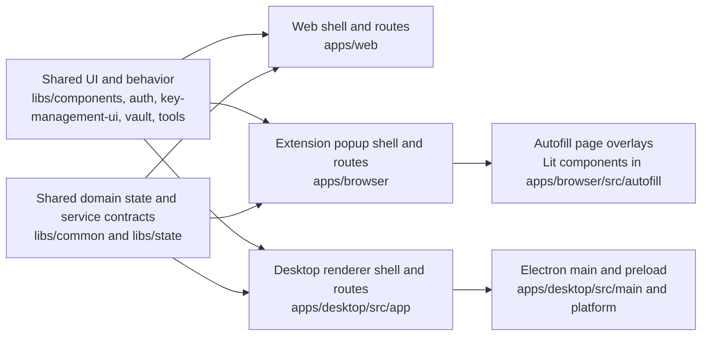

# UI redesign baseline

This document is a design-neutral map of the current UI. It records ownership and test seams; it
does not propose colors, layout, navigation, product behavior, or framework changes.

## Baseline identity

| Field              | Value                                                          |
| ------------------ | -------------------------------------------------------------- |
| Branch             | `test/ui-redesign-baseline`                                    |
| Base ref inspected | Local `origin/main`                                            |
| Base commit        | `1f881babc15eb7d3a88cad41730ce167d8e49a41`                     |
| Base subject       | `[CL-51] create file upload component (#20899)`                |
| Worktree           | `/Users/mateo/.t3/worktrees/bitwarden-clients/t3code-9c3b232b` |

No fetch was performed because this work must not mutate remote refs. The commit above is the exact
local `origin/main` value from which the worktree started.

## UI ownership map

### Shared layers

| Concern                   | Canonical owner                                                                                                                                                                                     | Boundary rule                                                                                                                                                  |
| ------------------------- | --------------------------------------------------------------------------------------------------------------------------------------------------------------------------------------------------- | -------------------------------------------------------------------------------------------------------------------------------------------------------------- |
| Design-system primitives  | [`libs/components/src`](../libs/components/src)                                                                                                                                                     | Buttons, forms, dialogs, tables, navigation primitives, headers, cards, typography, and responsive helpers should be changed here when the behavior is common. |
| Semantic theme tokens     | [`libs/components/src/theme.css`](../libs/components/src/theme.css), [`tw-theme.css`](../libs/components/src/tw-theme.css), [`tailwind.config.base.js`](../libs/components/tailwind.config.base.js) | Token names and semantic roles are shared. App Tailwind configs add app source paths, not a separate token system.                                             |
| Authentication forms      | [`libs/auth/src/angular`](../libs/auth/src/angular)                                                                                                                                                 | Login and most authentication bodies are reused; each app supplies routing, wrappers, and platform service implementations.                                    |
| Unlock                    | [`libs/key-management-ui/src/lock`](../libs/key-management-ui/src/lock)                                                                                                                             | The form is shared; biometric, passkey, policy, messaging, and post-unlock behavior remain platform adapters.                                                  |
| Vault item form           | [`libs/vault/src/cipher-form`](../libs/vault/src/cipher-form)                                                                                                                                       | Add, edit, clone, and partial-edit form UI is shared. Page chrome, item view, list orchestration, and capability checks vary by app.                           |
| Generator body            | [`libs/tools/generator/components/src`](../libs/tools/generator/components/src)                                                                                                                     | Credential generator controls are reusable. Web routes it as a page, browser wraps it in popup navigation, and desktop opens it as a dialog.                   |
| Domain state and services | [`libs/common/src`](../libs/common/src), [`libs/state`](../libs/state)                                                                                                                              | Interfaces, models, observable state, crypto, sync, search, policy, and account concepts are shared. App composition roots bind platform implementations.      |

### Platform shells and routes

| Platform          | Shell and routing owner                                                                                                                                                 | Current route families and presentation boundary                                                                                                                                                                                                                                                                                                                                                                                                                                                                                                                                                                                 |
| ----------------- | ----------------------------------------------------------------------------------------------------------------------------------------------------------------------- | -------------------------------------------------------------------------------------------------------------------------------------------------------------------------------------------------------------------------------------------------------------------------------------------------------------------------------------------------------------------------------------------------------------------------------------------------------------------------------------------------------------------------------------------------------------------------------------------------------------------------------- |
| Web               | [`apps/web/src/app/oss-routing.module.ts`](../apps/web/src/app/oss-routing.module.ts), [`layouts`](../apps/web/src/app/layouts)                                         | `FrontendLayoutComponent` owns public pages. `AnonLayoutWrapperComponent` owns login, signup, passkey, device login, SSO, password hint, two factor, lock, recovery, verification, and password transition flows. `UserLayoutComponent` owns authenticated `vault`, `sends`, `settings`, `tools`, reports, setup, and organization entry points. `tools` contains import, export, and generator; `settings` contains account, appearance, security, data recovery, domain rules, subscription, emergency access, and sponsored families. Organization/admin routing is composed separately below `organizations`.                |
| Browser extension | [`apps/browser/src/popup/app-routing.module.ts`](../apps/browser/src/popup/app-routing.module.ts), [`platform/popup/layout`](../apps/browser/src/platform/popup/layout) | Hash routing and `PopupRouterCacheService` preserve popup navigation state. Auth routes cover the shared login and unlock families. Authenticated popup routes include item view, add, edit, clone, attachments, password history, generator/history, import/export, autofill, account security, device management, appearance, notifications, folders, domain rules, premium/admin, send forms, trash/archive, autofill triage, and phishing warning. `tabs/vault`, `tabs/generator`, `tabs/send`, and `tabs/settings` use `PopupTabNavigationComponent`. Route elevation and browser/permission guards are extension-specific. |
| Desktop           | [`apps/desktop/src/app/app-routing.module.ts`](../apps/desktop/src/app/app-routing.module.ts), [`app/layout`](../apps/desktop/src/app/layout)                           | Shared auth routes are hosted in desktop wrappers, with desktop FIDO2 assertion, creation, and excluded-item routes. `DesktopLayoutComponent` owns authenticated `vault` and `send`. Generator, import, and export are desktop dialogs launched by the shell rather than routes. Native menus and window behavior are outside Angular routing.                                                                                                                                                                                                                                                                                   |

### Localization

- The abstraction and base implementation live under
  [`libs/common/src/platform`](../libs/common/src/platform). Angular surfaces render through the
  shared I18n pipe and service contracts.
- Web loads [`apps/web/src/locales`](../apps/web/src/locales) through its web I18n service and
  translation connector.
- The extension owns [`apps/browser/src/_locales`](../apps/browser/src/_locales). These catalogs
  also satisfy browser-manifest localization, and the browser I18n service uses the extension API's
  UI language.
- Desktop owns [`apps/desktop/src/locales`](../apps/desktop/src/locales) and has separate renderer
  and main-process I18n services because native menus and dialogs do not run in Angular.
- Copy changes therefore require catalog work per packaged app even when the component is shared.

### Theme and token ownership

- [`libs/components/src/theme.css`](../libs/components/src/theme.css) owns semantic CSS variables for
  light and dark themes. [`libs/components/src/tw-theme.css`](../libs/components/src/tw-theme.css)
  connects those variables to Tailwind utilities and component defaults.
- [`apps/web/tailwind.config.js`](../apps/web/tailwind.config.js),
  [`apps/browser/tailwind.config.js`](../apps/browser/tailwind.config.js), and
  [`apps/desktop/tailwind.config.js`](../apps/desktop/tailwind.config.js) extend the shared base only
  with platform source paths or platform needs.
- Web applies the saved/system theme early in [`apps/web/src/theme.ts`](../apps/web/src/theme.ts) to
  avoid an initial theme flash. Shared runtime theme state lives in
  [`libs/common/src/platform/theming/theme-state.service.ts`](../libs/common/src/platform/theming/theme-state.service.ts).
- Extension popup CSS also owns the fixed-window and compact-mode constraints. Autofill Lit
  surfaces import shared semantic tokens into isolated page overlays.
- Desktop imports the shared Tailwind theme but still contains legacy SCSS and receives system
  theme changes across its preload/main boundary. Those native and legacy seams must be verified
  independently before token removal.

### State and service composition

| Layer                 | Responsibility                                                                                                                                                                                             |
| --------------------- | ---------------------------------------------------------------------------------------------------------------------------------------------------------------------------------------------------------- |
| Shared libraries      | Account, authentication, vault, search, sync, policy, generator, messaging, storage, and state contracts and most domain behavior.                                                                         |
| Web composition       | Browser-window implementations, web environment/config loading, router guards, organization/admin services, and responsive shell state.                                                                    |
| Extension composition | Background and foreground service split, extension storage, tabs/windows/permissions, content-script messaging, popup route cache, current-tab context, native messaging, and badge/notification behavior. |
| Desktop composition   | Renderer DI, Electron-backed storage and messaging, native biometrics/autofill, OS integration, update/menu/window services, and main-process lifecycle.                                                   |

### Extension constraints

- Popup UI has a bounded extension window, compact and popped-out modes, hash routing, and cached
  route state. Do not infer ordinary responsive-browser behavior from the web vault.
- Privileged behavior depends on extension APIs for tabs, windows, permissions, storage, runtime
  messaging, native messaging, notifications, and commands. A plain Storybook iframe can render the
  UI but cannot prove those permissions or lifecycle transitions.
- Autofill UI is injected into arbitrary pages and implemented as Lit overlays under
  [`apps/browser/src/autofill`](../apps/browser/src/autofill). It has isolation, host-page CSS,
  z-index, content-security-policy, and cross-frame concerns that the Angular popup does not share.
- Browser-family and manifest-version packaging can alter permissions and capabilities, so a final
  redesign requires loaded-extension checks in each supported browser family.

### Electron boundaries

- Angular renderer code ends at the APIs exposed through [`apps/desktop/src/preload.ts`](../apps/desktop/src/preload.ts)
  and the feature-specific preload modules.
- [`apps/desktop/src/platform/preload.ts`](../apps/desktop/src/platform/preload.ts) bridges storage,
  credential storage, clipboard, power monitoring, IPC messaging, native messaging, SSO callbacks,
  system theme, and platform flags through Electron IPC.
- [`apps/desktop/src/main`](../apps/desktop/src/main) owns `BrowserWindow`, native menus, tray,
  updater, power monitor, clipboard, safe external links, native messaging, and window lifecycle.
- Native dialogs, biometrics, title-bar/window controls, OS menus, and updater states cannot be
  validated by an Angular Storybook screenshot. They require a packaged or development Electron
  run on each relevant operating system.

## Redesign surface matrix

| Surface              | Shared owner                                           | Web                                               | Browser                                                            | Desktop                                                | Redesign scope                                                                     | Baseline in this branch                                                                   |
| -------------------- | ------------------------------------------------------ | ------------------------------------------------- | ------------------------------------------------------------------ | ------------------------------------------------------ | ---------------------------------------------------------------------------------- | ----------------------------------------------------------------------------------------- |
| Login form           | `libs/auth`                                            | Shared body in web anonymous shell                | Shared body in extension anonymous wrapper                         | Shared body in desktop anonymous wrapper               | Once for form, per platform for shell and transitions                              | Desktop and narrow screenshots, semantic assertions, keyboard, axe                        |
| Unlock form          | `libs/key-management-ui`                               | Web service adapter                               | Browser biometrics/PRF/native-messaging adapter                    | Desktop biometric and IPC adapter                      | Once for basic form, per platform for unlock methods and shell                     | Desktop and narrow screenshots, keyboard, axe                                             |
| Vault list           | Shared primitives and domain models; app orchestration | Full responsive list and filters                  | Current-tab-aware popup list and bounded table/list                | Desktop list with desktop filters                      | Shared row/primitives once; list composition and commands per platform             | Web desktop/narrow list plus extension popup search                                       |
| Vault search         | Shared search service contract                         | Routed web filtering                              | Popup current-tab search and filters                               | Desktop filters                                        | Search semantics once; placement and platform context per platform                 | Keyboard-driven extension search with filtered result assertion                           |
| Item view            | Shared cipher models and field components              | Web view page                                     | Popup view route and autofill view action                          | Desktop view surface                                   | Fields once; page shell, action placement, permission/native behavior per platform | Autofill list asserts fill and view actions; full platform pages remain integration gates |
| Item add/edit        | `libs/vault/src/cipher-form`                           | Routed page/dialog wrapper                        | Popup routes and constrained wrapper                               | Renderer wrapper                                       | Form once; wrappers and platform capability actions per platform                   | Shared real edit form at desktop/narrow widths with axe and focus assertion               |
| Generator            | Shared generator component/core                        | `tools/generator` route                           | Popup tab and inline-menu generator                                | Dialog from desktop shell                              | Generator controls once; route/dialog/overlay chrome per platform                  | Real Lit autofill generator plus popup generator navigation boundary                      |
| Settings             | Shared components and service contracts                | Account, security, appearance, org/admin, billing | Popup account, vault, autofill, appearance, domain, admin settings | Renderer settings and native preferences/menu behavior | Shared controls once; information grouping and capabilities per platform           | Existing organization settings fixture at desktop/narrow widths                           |
| Autofill overlay     | Lit components in `apps/browser/src/autofill`          | Not applicable                                    | Injected cipher list, generator, prompts, notifications            | Separate desktop autofill/native work                  | Browser-only; reuse tokens and domain behavior, not Angular layout                 | Cipher list, generator, and save prompt screenshots with axe                              |
| Navigation and shell | `libs/components` primitives                           | Web header, side nav, layouts                     | Popup page/header/footer/tab navigation                            | Desktop header, side nav, native menu/window           | Primitives once; composition per platform                                          | Extension default/narrow popup shell; shared forms exercise web-like widths               |
| Themes               | `libs/components` semantic tokens                      | Early theme boot and web CSS                      | Popup plus isolated overlay imports                                | Shared CSS plus system theme IPC and legacy SCSS       | Tokens once; application and native seams per platform                             | Fixed light color scheme and reduced motion for deterministic baselines                   |
| Localization         | Common I18n contracts                                  | Web catalogs                                      | Manifest-compatible extension catalogs                             | Renderer and main-process catalogs                     | Keys/meaning once; catalog packaging per platform                                  | Fixed English fixtures and `en-US` browser locale                                         |

## Automated safety net

The Playwright suite in [`tests/ui-redesign`](../tests/ui-redesign) starts both existing Storybooks
and tests real rendered Angular and Lit components. It freezes locale, timezone, color scheme,
motion, fixture data, and viewport dimensions. Every covered story receives:

- a checked-in screenshot baseline;
- role, label, value, and visibility assertions tied to user-visible semantics;
- axe checks using the same `axe-playwright` dependency and Storybook context as the existing
  Storybook test runner;
- keyboard interaction or focus checks where the flow is interactive.

The extension popup table has a narrow, recorded exception for its existing `aria-allowed-role`,
`empty-table-header`, and `scrollable-region-focusable` violations. Every other axe rule remains
active there, and every rule remains active on all other baseline stories. The exception is a debt
marker, not an accessibility acceptance decision.

The desktop viewport is `1440 x 900`; the narrow shared viewport is `390 x 844`. Extension popup
checks use its actual `480 px` default boundary and `380 px` narrow fixture. Autofill overlays use a
`320 px` host viewport with their existing `280 px` component fixture.

See [`tests/ui-redesign/README.md`](../tests/ui-redesign/README.md) for commands and snapshot policy.

## Known integration gates

The browser Storybook cannot prove a loaded extension's service-worker suspension/restart,
permission prompts, browser commands, manifest/CSP behavior, arbitrary host-page collision, or
actual credential fill. Electron Storybook coverage cannot prove IPC serialization, native menus,
biometric prompts, updater windows, title bars, or OS-specific focus behavior. Before a redesigned
surface ships, run these gates in addition to this baseline:

1. Load the built extension in every supported browser family and exercise popup reopen, pop-out,
   permission denial, locked/unlocked transitions, and autofill injection on representative pages.
2. Run the desktop app on macOS, Windows, and Linux and exercise window controls, menus, dialogs,
   system-theme changes, biometrics where supported, and keyboard traversal between native and
   renderer UI.
3. Run the full existing Storybook axe suite and Chromatic workflow so primitives outside the
   highest-value flow set remain covered.

These are explicit platform gates, not candidates for fake browser or Electron APIs in the visual
baseline.
